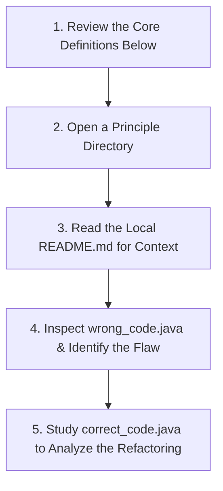

# 🚀 Mastering SOLID Principles

Welcome to this repository. This project is a practical, code-first guide designed to transform how you approach object-oriented design in **Java**. Moving beyond academic definitions, this repository uses a direct **Before vs. After** methodology to demonstrate exactly how rigid code is refactored into a clean, scalable, and production-ready architecture.

---

## 🗺️ Repository Structure

The repository is structured as a hands-on laboratory. The core logic resides in the `solid` directory, neatly segmented into the five foundational pillars of software design.

```text
📦 solid-principles-demo
 ┗ 📂 solid
   ┣ 📂 srp (Single Responsibility)
   ┣ 📂 ocp (Open/Closed)
   ┣ 📂 lsp (Liskov Substitution) ── 🔥 Start Here
   ┃ ┣ 📜 README.md         💾 In-depth theory & breakdown
   ┃ ┣ 📜 wrong_code.java   ❌ The anti-pattern (What NOT to do)
   ┃ ┗ 📜 correct_code.java  ✅ The refactored solution
   ┣ 📂 isp (Interface Segregation)
   ┗ 📂 dip (Dependency Inversion)

```

---

## 🧭 Your Learning Roadmap

To extract the most value from this repository, follow this structured workflow to understand the problem before looking at the solution:



1. **Spot the Trap:** Open `wrong_code.java` in any directory. Analyze the code to understand why it is fragile, rigid, or tightly coupled.
2. **Understand the Theory:** Read the `README.md` located inside that specific directory to understand the exact rule being violated.
3. **Analyze the Solution:** Open `correct_code.java` to see how applying the principle resolves the architectural flaws using Java interfaces, abstract classes, and proper inheritance.

---

## ⚡ The SOLID Pillars: Core Definitions

*Explore the individual directories to see these concepts implemented in Java.*

### 1. Single Responsibility Principle (SRP)

> **The Rule:** A Java class should do **one thing, and only one thing** well.

Think of a class like a specialized worker. If a single class is responsible for calculating business logic, executing database queries, and generating reports, it is doing too much. By keeping classes small and tightly focused on a single job, a change to your database configuration will not risk breaking your core logic.

### 2. Open/Closed Principle (OCP)

> **The Rule:** Java code should be **open for extension, but closed for modification**.

Once a Java class is written and tested, you should not have to constantly modify its internal code to accommodate new features. Instead, the architecture should leverage Java **interfaces** or **abstract classes** so that new behaviors can be introduced simply by writing new classes that extend or implement the existing contracts.

### 3. Liskov Substitution Principle (LSP)

> **The Rule:** A child class must be able to completely replace its parent class without breaking the program.

When utilizing inheritance in Java (`class Child extends Parent`), the child class must perfectly honor the behavioral contract established by the parent. If a parent class defines a method, the child class should not throw an unexpected `UnsupportedOperationException` or alter the core behavior so drastically that the application crashes when the child is substituted in.

### 4. Interface Segregation Principle (ISP)

> **The Rule:** Do not force a class to implement Java interface methods it does not actually need.

When designing a Java `interface`, keep it highly cohesive and specific. Creating a monolithic interface with dozens of methods forces implementing classes to write boilerplate code for functions they do not use. It is structurally sounder to create multiple small, distinct interfaces rather than one bloated contract.

### 5. Dependency Inversion Principle (DIP)

> **The Rule:** Rely on Java interfaces and abstract classes, not on concrete classes.

High-level business logic modules should never directly instantiate low-level utility classes (such as a specific database driver or logging framework) using the `new` keyword. Instead, the high-level class should depend on an abstraction. This inverts the control, allowing you to seamlessly swap out underlying technologies without rewriting the core application.