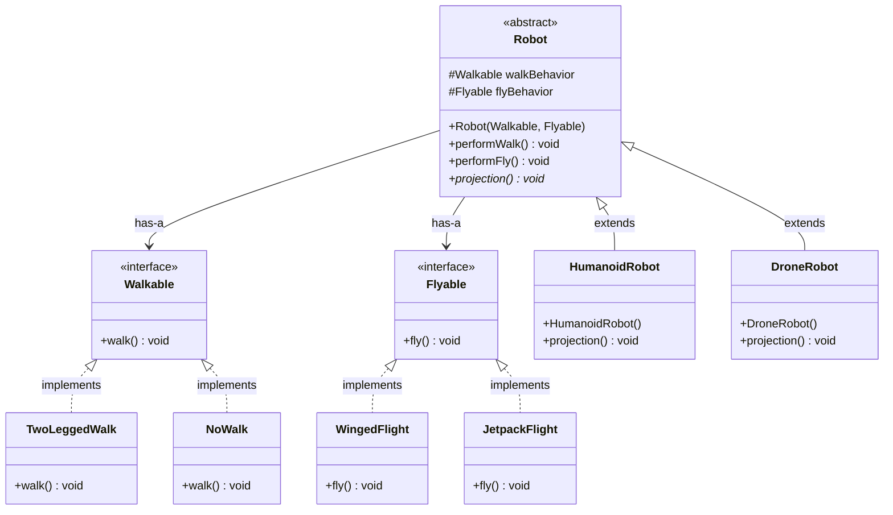

# 🤖 Strategy Design Pattern: Robot Simulation
The Strategy Design Pattern is a behavioral design pattern that allows you to define a family of algorithms, encapsulate each one inside its own class, and make them fully interchangeable.Instead of embedding multiple algorithms or behaviors directly inside a class using complex conditional statements (like if-else or switch), you delegate the execution to a separate "strategy" object at runtime.

---

## 🏗️ Architecture & UML Diagram

The core concept is that the `Robot` class delegates its walking and flying behavior to external interface implementations rather than defining them directly. 

Below is the UML class diagram representing the system's architecture:



---

## 🧩 Component Breakdown

The Strategy Pattern consists of three primary roles, all of which are utilized in this codebase:

* **The Strategy (Interfaces):** Define a common interface for a specific family of algorithms.
* `Walkable`: Declares the `walk()` behavior.
* `Flyable`: Declares the `fly()` behavior.


* **Concrete Strategies (Implementations):** The actual, swappable behaviors that implement the Strategy interfaces.
* *Walkable Behaviors:* `TwoLeggedWalk`, `NoWalk`
* *Flyable Behaviors:* `WingedFlight`, `JetpackFlight`


* **The Context (Client):** The class that maintains references to the Strategy objects and delegates the execution to them.
* `Robot`: The abstract base class holding references to `Walkable` and `Flyable`.
* `HumanoidRobot` & `DroneRobot`: Concrete contexts that inject specific behaviors into the parent `Robot` class via the constructor.


---

## 🛡️ SOLID Principles Analysis

The Strategy Pattern is a masterclass in object-oriented design because it inherently enforces all five SOLID principles. Here is how this architecture achieves that:

### 1. Single Responsibility Principle (SRP) ✅

Instead of the `Robot` class handling both what a robot *is* and what a robot *does*, the responsibilities are split:

* `TwoLeggedWalk` is solely responsible for the logic of walking.
* `JetpackFlight` is solely responsible for the logic of flying.
* `Robot` is solely responsible for maintaining the state of the robot and delegating actions.

### 2. Open/Closed Principle (OCP) ✅

If we want to introduce a new behavior—like a `HovercraftFlight` or `WheeledWalk`—we simply create a new class that implements `Flyable` or `Walkable`. We **do not need to modify** the `Robot`, `HumanoidRobot`, or `DroneRobot` classes to support this new feature. The system is open to infinite new behaviors but closed to modification of existing, tested code.

### 3. Liskov Substitution Principle (LSP) ✅

Look at the `performWalk()` method in the `Robot` class:

```java
public void performWalk() {
    walkBehavior.walk();
}

```

The `Robot` class does not know or care if `walkBehavior` is a `TwoLeggedWalk` or a `NoWalk`. Because every concrete strategy perfectly honors the `Walkable` interface contract, any walking strategy can be substituted at runtime, and the application will execute flawlessly without needing `instanceof` checks.

### 4. Interface Segregation Principle (ISP) ✅

Instead of creating one massive `RobotBehaviors` interface (e.g., forcing a `walk()`, `fly()`, and `swim()` method on every class), the interfaces are segregated into `Walkable` and `Flyable`. If a robot can walk but cannot fly (like a standard rover), it isn't forced to implement a `fly()` method just to leave it blank or throw an error.

### 5. Dependency Inversion Principle (DIP) ✅

The high-level `Robot` class does not depend on low-level, concrete implementations like `WingedFlight`. Instead, it depends entirely on the `Flyable` and `Walkable` **abstractions**.

```java
abstract class Robot {
    // Depending on abstractions, not concrete classes
    protected Walkable walkBehavior; 
    protected Flyable flyBehavior;
}

```

The concrete dependencies are injected via the constructor, decoupling the core robot architecture from specific mechanical implementations.

---

## 💡 Why Use the Strategy Pattern Here?

If we had used standard inheritance, we would be forced to implement `walk()` and `fly()` in the parent `Robot` class and override them constantly, leading to code duplication (e.g., rewriting jetpack logic for multiple unrelated robots).

By using the Strategy Pattern, we achieve:

* **Composition over Inheritance:** We build complex robots by snapping together simple, modular behaviors (`has-a`) rather than relying on deep, rigid class hierarchies (`is-a`).
* **Runtime Flexibility:** The behaviors (`walkBehavior` and `flyBehavior`) can easily be swapped dynamically during runtime by adding setter methods to the `Robot` class.