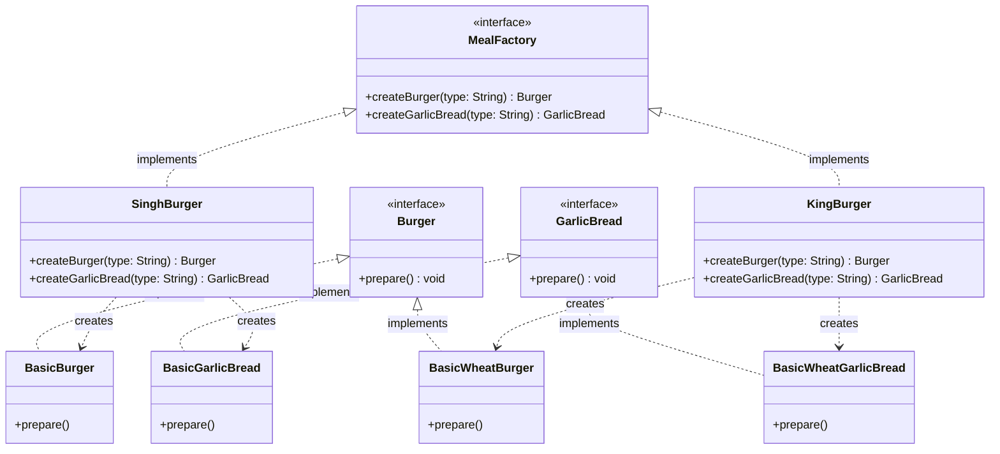

# 🍔 Factory Design Pattern: The Burger Franchise

The Factory Design Pattern is a creational design pattern that provides a centralized interface for creating objects without exposing the exact instantiation logic to the client. Instead of calling `new ConcreteClass()` directly, the client asks a "Factory" class or method to create and return the object. This delegates the responsibility of object instantiation, promoting loose coupling and making applications much easier to extend.

---

## 🏗️ Architecture & UML Diagram (Abstract Factory)

The pinnacle of this repository is the Abstract Factory pattern, which encapsulates the creation of *families* of related objects (Burgers and Garlic Bread).

Below is the UML class diagram representing the final `AbstractFactoryDemo` architecture:



*(Note: For visual clarity, only a subset of the concrete products like Premium and Cheese variants are shown, but they follow the exact same implementation tree).*

---

## 🧩 The Evolution: Three Stages of Object Creation

This repository breaks down the pattern into three executable files, showing how to scale a codebase as complexity grows. Think of this as scaling a restaurant business.

### Stage 1: The Simple Factory (`SimpleFactoryDemo.java`)

> **Definition:** A single, centralized class that handles all object instantiation using conditional logic based on input parameters.

**The Analogy:** A single food truck with one chef taking all the orders.

* **How it works:** We create one single class (`BurgerFactory`) with a static method containing a massive `switch` or `if/else` block. The client says "I want a basic burger," and the factory returns the correct object.
* **The Goal:** To pull the `new` keyword out of the client code and centralize object creation in one place.
* **The Fatal Flaw:** It violates the **Open/Closed Principle (OCP)**. If you want to add a `VeganBurger` to the menu, you are forced to physically open the `BurgerFactory` class and modify the `switch` statement. As the menu grows, this class becomes a bloated bottleneck.

### Stage 2: The Factory Method (`FactoryMethodDemo.java`)

> **Definition:** An interface for creating objects that allows subclasses to decide which specific concrete classes to instantiate.

**The Analogy:** Opening multiple distinct franchise locations (`SinghBurger`, `KingBurger`), where each location decides how to make their own version of the food.

* **How it works:** We solve the OCP violation by creating a `BurgerFactory` **interface**. We then let concrete sub-factories (`SinghBurger`, `KingBurger`) implement their own specific creation logic.
* **The Goal:** Decentralize creation. The client asks for a burger, but the *specific factory instance* they are talking to decides what kind of burger to make (e.g., `KingBurger` always returns a Wheat variant).
* **The Benefit:** Total compliance with the Open/Closed Principle. If a new franchise opens, you simply create a new class that implements `BurgerFactory`. You don't have to touch any existing code.

### Stage 3: The Abstract Factory (`AbstractFactoryDemo.java`)

> **Definition:** An interface for creating families of related or dependent objects without specifying their concrete classes.

**The Analogy:** Selling "Combo Meals" where the items must match the brand's specific theme.

* **How it works:** We expand the factory interface to create **families of related products**. Our `MealFactory` interface now forces the creation of both a `Burger` and a `GarlicBread`.
* **The Goal:** Enforce product compatibility. If a client goes to `KingBurger`, it would be a disaster if they got a Wheat Burger but standard white Garlic Bread. The Abstract Factory ensures that every item created by a specific factory matches that factory's "family" (theme).
* **The Benefit:** It guarantees that clients use compatible objects together. The client never has to worry about mixing up wheat and standard ingredients; the factory handles the consistency automatically.

---

## 🛡️ SOLID Principles Analysis

Creational patterns like the Factory Method and Abstract Factory rely heavily on SOLID principles to keep object creation modular and scalable.

### 1. Single Responsibility Principle (SRP) ✅

Instead of the main application handling both the *business logic* of running a restaurant and the *creation logic* of assembling ingredients, the responsibilities are split:

* The `Burger` and `GarlicBread` classes solely handle food preparation.
* The `MealFactory` classes solely handle object instantiation.

### 2. Open/Closed Principle (OCP) ✅

*(Fully realized in Factory Method and Abstract Factory)*
If you want to introduce a new franchise, you simply create a new factory class that implements `MealFactory`. You **do not need to modify** any existing factory or product classes. The system is entirely open for extension but safely closed for modification.

### 3. Liskov Substitution Principle (LSP) ✅

Look at the client code in the Abstract Factory:

```java
MealFactory mealFactory = new SinghBurger();
Burger burger = mealFactory.createBurger(burgerType);

```

The client code expects the `MealFactory` interface and the `Burger` interface. Because `SinghBurger` perfectly honors the factory contract, and `BasicBurger` perfectly honors the product contract, any factory or burger can be seamlessly substituted at runtime without crashing the application.

### 4. Interface Segregation Principle (ISP) ✅

The interfaces are kept lean and specific. The `Burger` interface only has one method: `prepare()`. Products are not forced to implement irrelevant methods (e.g., a burger is not forced to implement a `bakeCrust()` method meant for a pizza).

### 5. Dependency Inversion Principle (DIP) ✅

The high-level execution logic does not depend on low-level concrete classes like `BasicWheatBurger`. Instead, it depends entirely on the `Burger` and `MealFactory` **abstractions**.
The client simply says, *"Factory, give me a basic combo meal."* The concrete factory handles the low-level details of ensuring it is a wheat variant if it is processed by `KingBurger`.