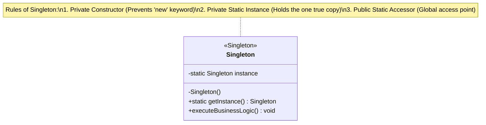

# 🛑 Singleton Design Pattern: The Highlander Principle

The **Singleton Design Pattern** is a creational design pattern that solves two problems simultaneously: it ensures that a class has exactly one instance, and it provides a global point of access to that instance. 

In enterprise software, it is commonly used when exactly one object is needed to coordinate actions across the system. Real-world examples include managing a shared database connection pool, a centralized configuration manager, a logging service, or a thread pool. 

This repository tracks the evolution of the Singleton pattern through four distinct architectural stages, addressing the critical challenges of multithreading and application performance.

---

## 🏗️ Architecture & UML Diagram

The structure of a Singleton is uniquely self-contained. It relies on a private constructor to prevent external instantiation, a static variable to hold the sole instance, and a public static method to provide access to it.

Below is the UML class diagram representing the Singleton architecture:

---

## 🧩 The Evolution: Four Stages of Singleton Creation

Creating a Singleton seems trivial until you introduce multiple threads. This repository breaks down the pattern into four executable files, showing how to scale the design for enterprise, multithreaded environments.

### Stage 1: The Simple Singleton (`SimpleSingletonDemo.java`)

* **What it is:** The most basic implementation using **Lazy Initialization**. It only creates the instance when `getInstance()` is called for the very first time.
* **The Benefit:** Memory is saved because the object is not created until it is actually needed.
* **The Fatal Flaw:** It is **NOT thread-safe**. If two concurrent threads check `if (instance == null)` at the exact same millisecond, they will both evaluate to true, and both will create a brand new instance. The Singleton contract is broken.

### Stage 2: The Eager Singleton (`ThreadSafeEagerSingletonDemo.java`)

* **What it is:** The instance is created immediately when the class is loaded by the JVM (`private static instance = new ...`).
* **The Benefit:** It is **100% thread-safe** without any complex locking logic. The JVM guarantees the instance is created before any thread can access it.
* **The Flaw:** It wastes resources. If this Singleton holds a massive database connection pool or consumes significant memory, and the client application never actually calls `getInstance()`, that memory is tied up and wasted for the lifetime of the application.

### Stage 3: The Synchronized Singleton (`ThreadSafeLockingSingletonDemo.java`)

* **What it is:** We return to Lazy Initialization but wrap the instantiation logic in a `synchronized` block to ensure only one thread can access it at a time.
* **The Benefit:** It fixes the multithreading bug from Stage 1 while preserving the memory-saving benefits of Lazy Initialization.
* **The Flaw:** A massive **performance bottleneck**. Synchronization is an expensive CPU operation. Once the instance is created, every subsequent call to `getInstance()` by *any* thread will be forced to wait in line, even though the instance already exists and only requires a simple read operation.

### Stage 4: Double-Checked Locking (`ThreadSafeDoubleLockingSingletonDemo.java`)

* **What it is:** The industry standard for high-performance, thread-safe Singletons. It checks if the instance is null *before* acquiring the lock, acquires the lock, and then checks *again* before creating the object.
* **The Benefit:** You get the best of all worlds. You get Lazy Initialization (memory saving), Thread Safety (no duplicate instances), and High Performance (the lock is only engaged on the very first creation, not on subsequent reads).
* **💡 Pro-Tip for Java:** To make this completely bulletproof in production Java, the `instance` variable should be declared with the `volatile` keyword (e.g., `private static volatile ThreadSafeDoubleLockingSingletonDemo instance;`). This prevents the JVM from reordering instructions, ensuring perfectly safe publication across all threads.

---

## 🛡️ SOLID Principles Analysis: The Singleton Controversy

Unlike other design patterns that beautifully enforce SOLID principles, the Singleton pattern is often criticized because it inherently **violates** several of them. It is important to understand these trade-offs before utilizing it in a production environment.

### 1. Single Responsibility Principle (SRP) ⚠️ Violated

The Singleton inherently has two distinct responsibilities:

1. It manages its own creation and lifecycle (ensuring only one instance exists).
2. It executes its actual business logic (e.g., managing database connections or writing to a log file).
Because it does two different things, it has multiple reasons to change, violating SRP.

### 2. Open/Closed Principle (OCP) ⚠️ Hard to Maintain

Singletons are notoriously difficult to extend. Because the constructor is strictly `private` and the instance is `static`, you cannot easily subclass a Singleton to alter its behavior without modifying the existing class directly.

### 3. Liskov Substitution Principle (LSP) ⚠️ Hard to Apply

Because Singletons are rarely subclassed (due to the private constructor restriction), polymorphic substitution is almost never applicable.

### 4. Dependency Inversion Principle (DIP) ⚠️ Violated

High-level modules should depend on abstractions (interfaces), not concrete implementations. However, clients usually invoke a Singleton directly by calling the concrete class: `MyDatabaseSingleton.getInstance()`. This tightly couples your application to the concrete Singleton class, making it very difficult to swap out implementations or write unit tests (since you cannot easily pass in a mock object).