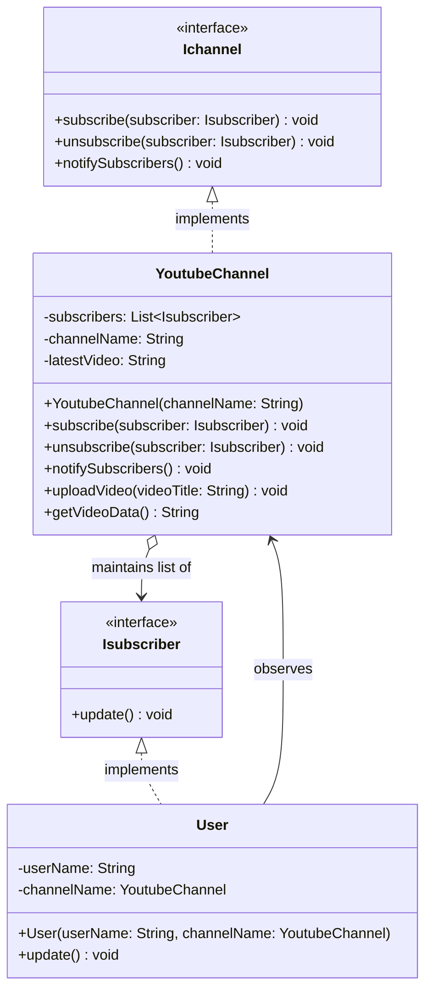

# 📺 Observer Design Pattern: The YouTube Channel

The Observer Design Pattern is a behavioral software design pattern that defines a one-to-many dependency between objects. When one object (the subject) changes state, all its dependents (the observers) are notified and updated automatically.

In essence, it establishes a subscription mechanism to notify multiple objects about any events that happen to the object they're observing. Instead of observers constantly polling the subject to check for updates, the subject pushes updates to them as soon as they happen.

This repository demonstrates this concept using a highly relatable analogy: **A YouTube Channel and its Subscribers**.

---

## 🏗️ Architecture & UML Diagram

The architecture relies heavily on decoupling the entity that produces updates (the channel) from the entities that consume them (the users).

Below is the UML class diagram representing the `ObserverPatternDemo` architecture:



---

## 🧩 The Core Mechanics: How It Works

This implementation breaks down the pattern into two distinct roles to show how state changes are broadcasted. Think of this as the notification bell on a video platform.

### The Subject (`Ichannel` & `YoutubeChannel`)

**The Analogy:** The content creator who produces videos.

* **How it works:** The `YoutubeChannel` implements the `Ichannel` interface, maintaining a dynamic list of `Isubscriber` objects. When the channel triggers an action—specifically `uploadVideo()`—it updates its internal state (`latestVideo`) and immediately calls `notifySubscribers()`.
* **The Goal:** To manage a registry of interested parties and broadcast state changes to them without needing to know *who* or *what* those parties are, only that they implement the expected interface.

### The Observer (`Isubscriber` & `User`)

**The Analogy:** The fans who click the "Subscribe" button.

* **How it works:** The `User` implements the `Isubscriber` interface, which mandates an `update()` method. When the user is created, they are passed a reference to the `YoutubeChannel` they are observing. When the channel loops through its subscriber list and fires `update()`, the `User` queries the channel for the new data (`getVideoData()`) and acts on it (printing a personalized notification).
* **The Goal:** To remain completely passive until explicitly tapped by the Subject, ensuring that the system only expends resources when a state change actually occurs.

---

## 🛡️ SOLID Principles Analysis

Behavioral patterns like the Observer pattern rely heavily on SOLID principles to keep event-driven code modular and prevent tight coupling.

### 1. Single Responsibility Principle (SRP) ✅

Responsibilities are cleanly divided:

* The `YoutubeChannel` handles the business logic of managing its own name, video state, and its subscription registry.
* The `User` handles the logic of reacting to the notification and displaying its own custom alert. Neither class is burdened with doing the other's job.

### 2. Open/Closed Principle (OCP) ✅

The system is open for extension but closed for modification. If we want to add a new type of subscriber (for example, a `ModeratorBot` or an `AnalyticsTracker`), we simply create a new class that implements `Isubscriber`. We **do not need to modify** a single line of the `YoutubeChannel` code to support these new observer types.

### 3. Liskov Substitution Principle (LSP) ✅

Look at the `subscribe` method signature:

```java
public void subscribe(Isubscriber subscriber)

```

The channel expects the `Isubscriber` interface. Because `User` perfectly honors this contract by implementing the `update()` method, any class that implements `Isubscriber` can be passed into the channel's subscription list without breaking the application's behavior.

### 4. Interface Segregation Principle (ISP) ✅

The interfaces are laser-focused. `Isubscriber` forces exactly one behavior: `update()`. It doesn't force the observer to implement unnecessary methods like `likeVideo()` or `leaveComment()`. Similarly, `Ichannel` only outlines the absolute necessities for managing a registry and notifying it.

### 5. Dependency Inversion Principle (DIP) ✅

The high-level broadcast logic in `YoutubeChannel` does not depend on low-level concrete classes like `User`. Instead, it depends entirely on the `Isubscriber` **abstraction**.
When the channel notifies its list, it doesn't care if the object is an "Alice" or a "Bob". It simply says, *"I have a new video, invoke the update method on whoever is listening."*