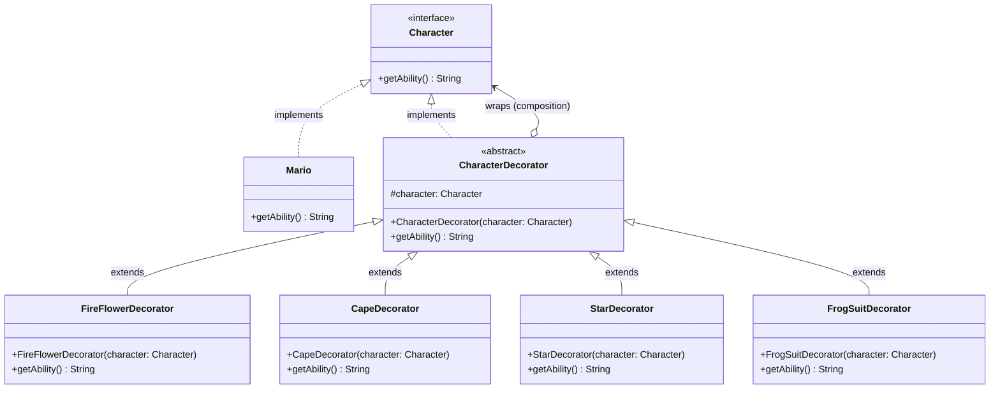

# 🍄 Decorator Design Pattern: Super Mario Power-Ups

The Decorator Design Pattern is a structural software design pattern that lets you attach new behaviors to objects dynamically by placing them inside special wrapper objects that contain these behaviors. It provides a flexible, scalable alternative to subclassing for extending functionality.

Instead of creating massive, complex class hierarchies to handle every possible combination of features, you start with a base object and "decorate" it layer by layer.

This repository demonstrates this concept using the classic video game mechanic of **Mario and his Power-Ups**.

---

## 🏗️ Architecture & UML Diagram

The architecture centers around a shared interface that both the base component and the wrappers implement, allowing objects to be seamlessly nested inside one another.

Below is the UML class diagram representing the `DecoratorPatternDemo` architecture:

---

## 🧩 The Core Mechanics: How It Works

This implementation uses the concept of composition and delegation to build complex objects at runtime.

### The Base Component (`Character` & `Mario`)

* **How it works:** The `Character` interface establishes the fundamental contract for the application: a single `getAbility()` method. The `Mario` class implements this interface to act as our core concrete component, providing the default baseline behavior by returning "I am Mario, I can jump!".

### The Wrapper (`CharacterDecorator`)

* **How it works:** This abstract class acts as the blueprint for all power-ups. It implements the `Character` interface so it can stand in for a standard character, but crucially, it also maintains a protected reference to a `Character` object (`protected Character character`).

### The Power-Ups (Concrete Decorators)

* **How it works:** Classes like `FireFlowerDecorator`, `CapeDecorator`, `StarDecorator`, and `FrogSuitDecorator` extend the abstract `CharacterDecorator`. When their `getAbility()` method is called, they delegate the initial call to the wrapped character's `getAbility()` method, and then append their own unique string (e.g., " I can also shoot fireballs!" or " I can also fly!").

* **The Magic of Chaining:** Because every decorator both *is a* `Character` and *contains a* `Character`, they can be nested indefinitely. As demonstrated in the client code, you can wrap a `Mario` object in a `FrogSuitDecorator`, then wrap that result in a `StarDecorator`, then a `CapeDecorator`, and finally a `FireFlowerDecorator` to create a `superMario` with accumulated abilities.

---

## 🛡️ SOLID Principles Analysis

Structural patterns like the Decorator pattern inherently encourage strong object-oriented design by favoring composition over inheritance.

### 1. Single Responsibility Principle (SRP) ✅

Functionalities are cleanly divided into distinct classes. The `Mario` class only cares about its base abilities. The `CapeDecorator` only cares about adding flying capabilities. No single class is bloated with the logic for multiple, unrelated power-ups.

### 2. Open/Closed Principle (OCP) ✅

The application is entirely open for extension but safely closed for modification. If we want to add an `IceFlowerDecorator` or a `TanookiSuitDecorator`, we simply create new classes that extend `CharacterDecorator`. We do not have to touch the existing `Mario` class or any of the existing decorators.

### 3. Liskov Substitution Principle (LSP) ✅

Every decorator implements the base `Character` interface. This guarantees that a decorated object (like `fireMario`) can be passed into any function or variable that expects a standard `Character` without breaking the application's behavior.

### 4. Interface Segregation Principle (ISP) ✅

The `Character` interface is incredibly lean, enforcing only the `getAbility()` method. The concrete components and decorators are not forced to implement bulky, irrelevant methods that don't apply to them.

### 5. Dependency Inversion Principle (DIP) ✅

The decorators do not depend on the concrete `Mario` class. Instead, the `CharacterDecorator` depends on the `Character` interface abstraction (`protected Character character`). This vital abstraction is what allows the decorators to wrap not just `Mario`, but also other decorators, enabling the chaining behavior.