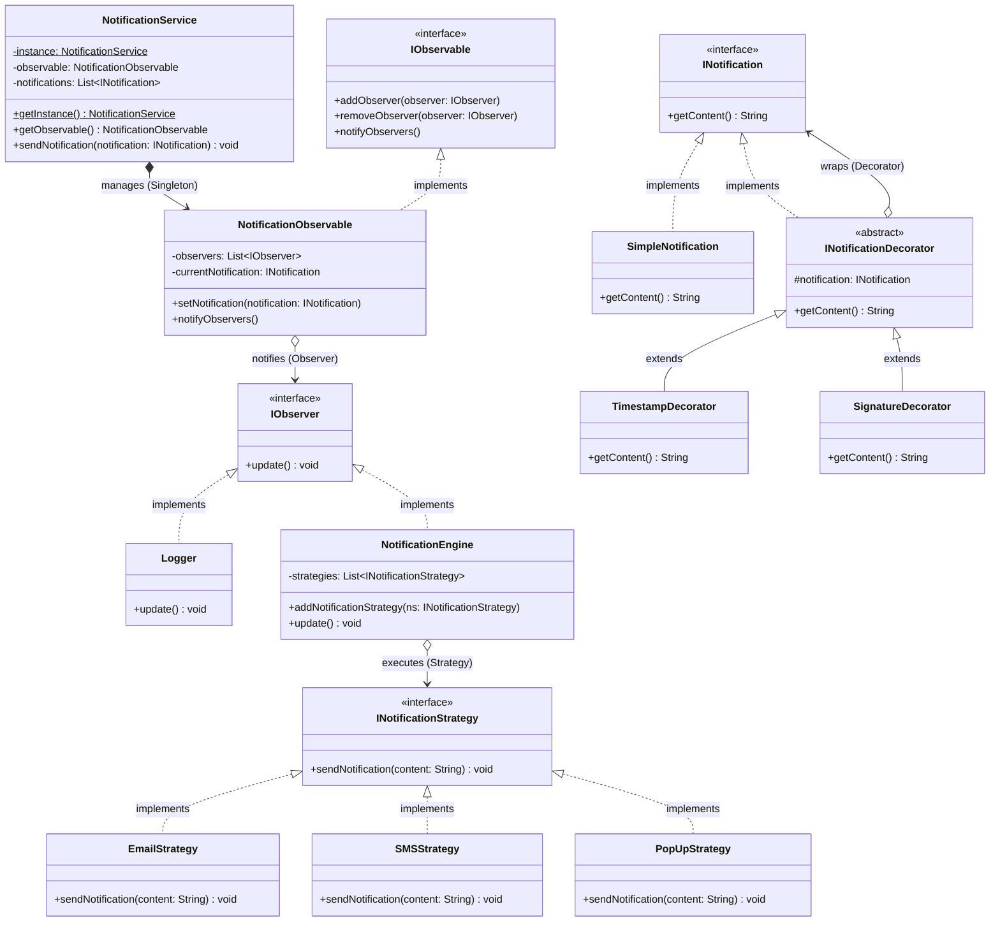

# 🔔 Notification System: A Compound Pattern Architecture

In real-world enterprise software, design patterns rarely exist in isolation. Complex systems often require multiple patterns working together in harmony to achieve high cohesion and low coupling.

This repository demonstrates a **Compound Architecture**, combining four distinct design patterns—**Singleton, Observer, Strategy, and Decorator**—to build a highly scalable and flexible **Notification Dispatch System**.

---

## 🏗️ Architecture & UML Diagram

This architecture separates state management, event broadcasting, delivery mechanisms, and content formatting into distinct, interchangeable modules.

Below is the UML class diagram representing the complete system architecture:

---

## 🧩 The Core Mechanics: Four Patterns in Harmony

This system elegantly delegates responsibilities to four different design patterns, ensuring that no single class becomes an unmaintainable "God Object."

### 1. The Singleton Pattern (`NotificationService`)

* **The Role:** The Central Dispatcher.
* **How it works:** It restricts the instantiation of the `NotificationService` to a single, globally accessible object. This ensures that the entire application shares one consistent notification queue and one central `NotificationObservable` subject, preventing duplicate dispatchers from interfering with each other.

### 2. The Observer Pattern (`NotificationObservable`, `Logger`, `NotificationEngine`)

* **The Role:** The Event Broadcaster.
* **How it works:** When the Singleton service receives a new message, it updates the `NotificationObservable`. The observable maintains a dynamic list of subscribers (like the `Logger` and the `NotificationEngine`). Instead of the service calling the logger directly, it simply shouts *"New notification!"*, and the attached observers react automatically.

### 3. The Strategy Pattern (`INotificationStrategy`, `EmailStrategy`, `SMSStrategy`)

* **The Role:** The Delivery Mechanism.
* **How it works:** The `NotificationEngine` doesn't know *how* to send an SMS or an Email. Instead, it maintains a list of `INotificationStrategy` objects. At runtime, you can attach any delivery strategy to the engine. When the engine is triggered by the Observer pattern, it loops through its active strategies and fires their respective `sendNotification()` methods.

### 4. The Decorator Pattern (`INotification`, `TimestampDecorator`, `SignatureDecorator`)

* **The Role:** The Content Formatter.
* **How it works:** Instead of hardcoding formatted messages, we start with a `SimpleNotification` ("Your order has been shipped!"). Before sending it to the Singleton, we wrap it in a `TimestampDecorator` and then a `SignatureDecorator`. Each wrapper dynamically appends its specific text to the payload, building a fully formatted string at runtime.

---

## 🛡️ SOLID Principles Analysis

Combining patterns naturally guides an application toward strict adherence to SOLID principles, resulting in a highly robust codebase.

### 1. Single Responsibility Principle (SRP) ✅

Every class has exactly one reason to change:

* The `Logger` only cares about writing to the console.
* The `EmailStrategy` only cares about email routing protocols.
* The `TimestampDecorator` only cares about injecting the current date and time.

### 2. Open/Closed Principle (OCP) ✅

The entire architecture is plug-and-play.

* Need to add Slack integration? Create a `SlackStrategy` and pass it to the engine.
* Need an urgent priority tag on the message? Create an `UrgencyDecorator`.
* Need an analytics tracker? Create an `AnalyticsObserver`.
**None** of these additions require modifying the existing `NotificationService` or `NotificationEngine` classes.

### 3. Liskov Substitution Principle (LSP) ✅

Because the components rely heavily on interfaces (`INotification`, `IObserver`, `INotificationStrategy`), any concrete implementation can safely be swapped in. The `NotificationEngine` treats `EmailStrategy` and `PopUpStrategy` exactly the same, iterating through them safely.

### 4. Interface Segregation Principle (ISP) ✅

The interfaces act as tiny, focused contracts. `IObserver` only requires `update()`. `INotificationStrategy` only requires `sendNotification()`. This prevents concrete classes from inheriting bloated code they don't actually need to execute their specific behaviors.

### 5. Dependency Inversion Principle (DIP) ✅

The `NotificationEngine` depends on the `INotificationStrategy` abstraction rather than concrete delivery classes. The `NotificationObservable` depends on the `IObserver` abstraction rather than specific loggers or engines. High-level orchestrators are entirely insulated from low-level implementation details.