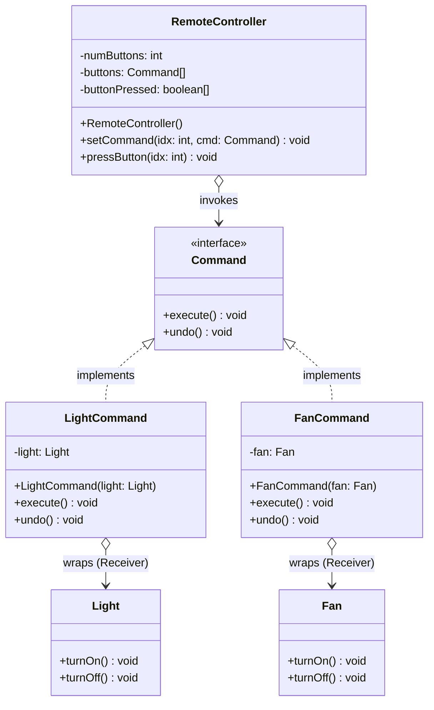

# 🎛️ Command Design Pattern: The Universal Remote

The Command Design Pattern is a behavioral software design pattern that encapsulates a request as a stand-alone object containing all information about the request. This transformation lets you parameterize methods with different requests, delay or queue a request's execution, and support undoable operations.

In essence, it decouples the object that invokes the operation from the object that knows how to perform it.

This repository demonstrates this concept using a classic smart home analogy: **A Universal Remote Control operating different appliances**.

---

## 🏗️ Architecture & UML Diagram

The architecture centers around turning actions into objects. The remote control doesn't need to know how a fan or a light works; it only needs to know how to trigger a command.

Below is the UML class diagram representing the `CommandPatternDemo` architecture:

---

## 🧩 The Core Mechanics: How It Works

This implementation separates the system into Invokers, Commands, and Receivers to achieve a highly decoupled architecture.

### The Receivers (`Light` & `Fan`)

* **How it works:** These are the actual smart devices that know how to perform the business logic. The `Light` and `Fan` classes contain the concrete methods like `turnOn()` and `turnOff()`.

### The Command Interface & Concrete Commands (`Command`, `LightCommand`, `FanCommand`)

* **How it works:** The `Command` interface establishes a simple contract containing `execute()` and `undo()` methods.

* Concrete classes like `LightCommand` take a `Light` object as a dependency through their constructor. When `execute()` is called, it translates this to the receiver's `turnOn()` method, and when `undo()` is called, it calls the receiver's `turnOff()` method.

### The Invoker (`RemoteController`)

* **How it works:** The `RemoteController` acts as the trigger. It maintains an array of `Command` objects (`buttons`) and a boolean array (`buttonPressed`) to track the state of each button.

* Commands are mapped to specific button indexes using the `setCommand()` method.

* When `pressButton()` is triggered, the remote checks the `buttonPressed` boolean array. If the button is currently "off" (false), it calls the command's `execute()` method; if it is currently "on" (true), it calls the `undo()` method, and then effectively toggles the state.

---

## 🛡️ SOLID Principles Analysis

Behavioral patterns like the Command pattern are phenomenal for structuring logic in a way that respects SOLID design principles.

### 1. Single Responsibility Principle (SRP) ✅

Responsibilities are cleanly decoupled:

* The `RemoteController` handles mapping buttons and triggering actions.

* The `LightCommand` handles bridging the gap between an action and a specific device.

* The `Light` handles the actual operation of lighting up.

### 2. Open/Closed Principle (OCP) ✅

The application is open for extension. If you buy a new smart TV, you simply create a `TV` receiver and a `TVCommand` class that implements `Command`. You can assign this new command to the `RemoteController` via `setCommand()` without modifying the remote's internal code.

### 3. Liskov Substitution Principle (LSP) ✅

The `RemoteController` stores an array of `Command` objects. Because `LightCommand` and `FanCommand` properly implement this interface, they can be freely substituted into any button slot (e.g., `remote.setCommand(0, lightCommand)`) without breaking the invoker's logic.

### 4. Interface Segregation Principle (ISP) ✅

The `Command` interface is extremely minimal, forcing the implementation of only two methods: `execute()` and `undo()`. Objects are not burdened with implementing unnecessary features.

### 5. Dependency Inversion Principle (DIP) ✅

The `RemoteController` (Invoker) does not depend on concrete receivers like `Light` or `Fan`. Instead, it depends on the `Command` abstraction. The remote doesn't know what it is turning on; it just knows that pressing the button fires a standardized execution contract.