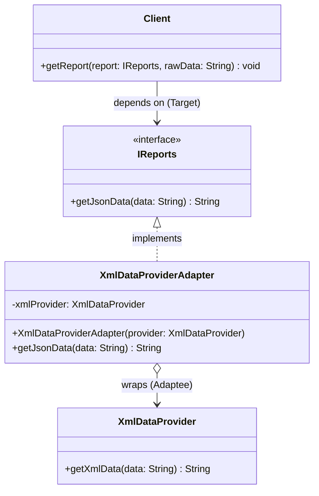

# 🔌 Adapter Design Pattern: The Data Translator

The Adapter Design Pattern is a structural software design pattern that allows objects with incompatible interfaces to collaborate. It acts as a wrapper that catches calls to one object and transforms them to a format and interface recognizable by another object.

In essence, it works exactly like a physical travel adapter: if your client requires a modern three-prong plug (JSON), but your legacy service only has a two-prong outlet (XML), the adapter bridges the gap between them without requiring you to rewire the wall.

This repository demonstrates this concept using a common modern development scenario: **Converting legacy XML data outputs into modernized JSON responses**.

---

## 🏗️ Architecture & UML Diagram

The architecture centers around decoupling the client’s expected interface from the third-party or legacy class’s actual implementation.

Below is the UML class diagram representing the `AdapterPatternDemo` architecture:

---

## 🧩 The Core Mechanics: How It Works

This implementation separates the system into four standard Adapter Pattern roles to ensure seamless communication between incompatible systems.

### 1. The Target (`IReports`)

* **How it works:** This is the domain-specific interface that the client code understands and expects to work with. In this system, the Target mandates that any reporting service must expose a `getJsonData(String data)` method.

### 2. The Adaptee (`XmlDataProvider`)

* **How it works:** This represents a legacy service, third-party library, or existing class that has useful functionality but an incompatible interface. It processes raw string data (e.g., `"Alice:42"`) and returns an XML string (`<user><name>Alice</name>...`). The client cannot use this directly because it expects JSON.

### 3. The Adapter (`XmlDataProviderAdapter`)

* **How it works:** This is the translator class. It bridges the gap by implementing the `IReports` interface (so the client accepts it) while maintaining a reference to the `XmlDataProvider` inside it.
* When the client calls `getJsonData()`, the adapter intercepts the call, delegates the heavy lifting to the Adaptee's `getXmlData()` method, and then parses and transforms the returned XML into a perfectly formatted JSON string before handing it back to the client.

### 4. The Client (`Client`)

* **How it works:** The main application logic. It is strictly coded to interact with the `IReports` interface. It passes raw data and prints the results, blissfully unaware that a complex XML-to-JSON conversion is happening behind the scenes.

---

## 🛡️ SOLID Principles Analysis

Structural patterns like the Adapter pattern are essential for maintaining clean architecture when integrating disparate systems or migrating legacy code.

### 1. Single Responsibility Principle (SRP) ✅

Responsibilities are cleanly separated. The `XmlDataProvider` solely focuses on generating XML. The `Client` solely focuses on triggering reports. The `XmlDataProviderAdapter` is solely responsible for data translation and interface mapping. No single class is forced to juggle both business logic and data-parsing logic.

### 2. Open/Closed Principle (OCP) ✅

You can introduce new types of adapters into the program without breaking the existing client code. If you later need to integrate a `CsvDataProvider` or a `YamlDataProvider`, you simply create new adapter classes implementing `IReports`. The `Client` class remains completely untouched.

### 3. Liskov Substitution Principle (LSP) ✅

The `Client` expects an `IReports` object. Because the `XmlDataProviderAdapter` properly honors this contract by providing a functional `getJsonData()` method, it can be passed into `client.getReport()` safely. The application continues to function perfectly without the client ever knowing it’s talking to an adapter instead of a native JSON provider.

### 4. Interface Segregation Principle (ISP) ✅

The `IReports` interface is perfectly streamlined, enforcing only the exact method the client needs (`getJsonData`). It doesn't force incoming services to implement bloated, unnecessary methods.

### 5. Dependency Inversion Principle (DIP) ✅

The high-level `Client` module does not depend on the low-level `XmlDataProvider` concrete class. Instead, it depends on the high-level `IReports` abstraction. The Adapter takes on the burden of depending on the concrete legacy class, shielding the rest of your modern application from tight coupling to old or third-party code.