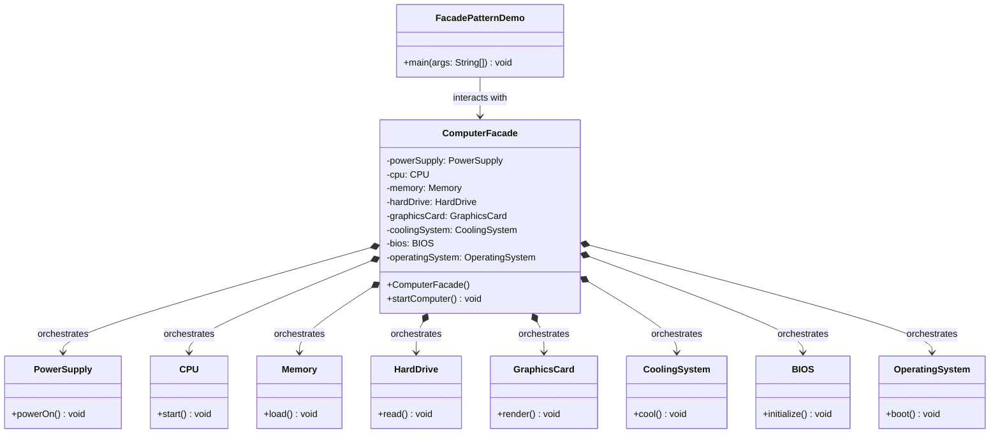

# 🖥️ Facade Design Pattern: The Push-Button Boot Sequence

The Facade Design Pattern is a structural software design pattern that provides a simplified, higher-level interface to a complex subsystem of classes, a library, or a framework.

In essence, it hides the complex logic of moving parts behind a single, easy-to-use method. Instead of forcing the client to understand how to orchestrate a dozen different objects in the exact right order, the Facade does the heavy lifting for them.

This repository demonstrates this concept using a universally understood analogy: **Turning on a Computer**.

---

## 🏗️ Architecture & UML Diagram

The architecture centers around shielding the Client from the underlying complexity of the system. The client only talks to the Facade, and the Facade manages the intricate web of subsystem dependencies.

Below is the UML class diagram representing the `FacadePatternDemo` architecture:

---

## 🧩 The Core Mechanics: How It Works

This implementation separates the application into a messy, complex backend (the subsystems) and a clean, unified frontend (the facade).

### 1. The Complex Subsystems (The Hardware)

* **How it works:** Classes like `CPU`, `Memory`, `PowerSupply`, and `BIOS` represent a highly complex set of moving parts. Each class has its own specific methods (`start()`, `load()`, `powerOn()`, `initialize()`).
* **The Problem:** If a client wanted to turn on the computer, they would need to instantiate all eight of these classes and call their specific methods in the exact, correct boot sequence. If they load the OS before powering the supply, the system crashes.

### 2. The Facade (`ComputerFacade`)

* **How it works:** This class acts as the unified control panel. In its constructor, it creates instances of all the necessary subsystems. It then exposes a single method: `startComputer()`.
* **The Orchestration:** When `startComputer()` is called, the Facade internally executes the precise, multi-step boot sequence—powering on, initializing the BIOS, starting the CPU, loading memory, reading the drive, rendering graphics, cooling the system, and booting the OS.

### 3. The Client (`FacadePatternDemo`)

* **How it works:** The client code represents the end-user pressing the power button on their PC case. They simply instantiate the `ComputerFacade` and call `startComputer()`. They are blissfully unaware of the `GraphicsCard` or the `CoolingSystem` existing behind the scenes.

---

## 🛡️ Design Principles Analysis

The Facade pattern excels at promoting loose coupling and organizing messy integrations.

### 1. Law of Demeter (Principle of Least Knowledge) ✅

The Facade pattern is a textbook example of this principle. The Client (`FacadePatternDemo`) only talks to its immediate friend (`ComputerFacade`). It does not reach *through* the facade to directly manipulate the `CPU` or `Memory`. It only knows about the single button it is allowed to press.

### 2. Single Responsibility Principle (SRP) ✅

By introducing the Facade, responsibilities are cleanly isolated:

* The subsystem classes (`HardDrive`, `BIOS`) are strictly responsible for their own specific hardware operations.
* The `ComputerFacade` is strictly responsible for the *orchestration* of those components. It doesn't perform the logic itself; it just directs traffic.

### 3. Open/Closed Principle (OCP) ✅

If you upgrade the computer by adding an `RGBLighting` subsystem, you simply update the `ComputerFacade` to include it in the boot sequence. Because the Client code relies entirely on the `startComputer()` abstraction, the Client code requires absolutely zero modifications to support this new hardware.

### 4. Loose Coupling ✅

Without a Facade, the Client class would have eight direct dependencies (one for each hardware component). By using the pattern, the Client has exactly one dependency (the Facade). This drastically reduces the structural rigidity of the application, making it much easier to test, maintain, and scale.