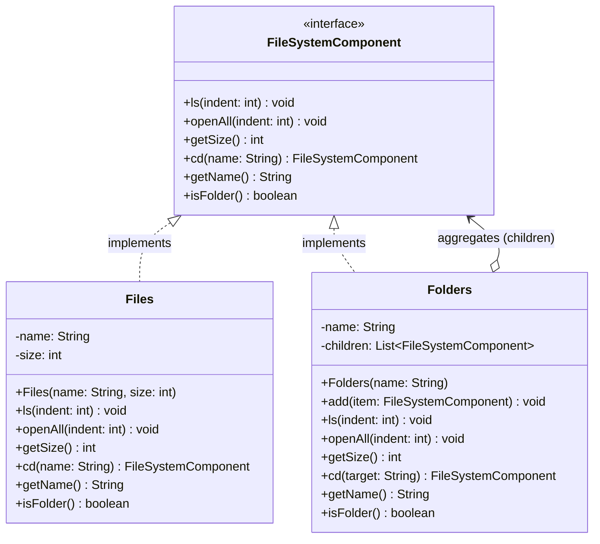

# 🗂️ Composite Design Pattern: The File System

The Composite Design Pattern is a structural software design pattern that lets you compose objects into tree structures to represent part-whole hierarchies. It allows clients to treat individual objects and compositions of objects uniformly.

In essence, if you have a tree of objects, the client code shouldn't have to care whether it is interacting with a single "leaf" node or a complex "branch" containing many nodes. They both share a common interface that delegates behavior appropriately.

This repository demonstrates this concept using the most universal example of a tree structure: **A File System composed of Files and Folders**.

---

## 🏗️ Architecture & UML Diagram

The architecture centers around a shared component interface. Because both the "container" and the "item" implement the exact same interface, the container can hold a list of items *and* other containers indiscriminately.

Below is the UML class diagram representing the `CompositePatternDemo` architecture:

---

## 🧩 The Core Mechanics: How It Works

This implementation separates the application into three distinct roles to form the recursive tree structure.

### 1. The Component (`FileSystemComponent`)

* **How it works:** This is the universal interface that both files and folders must adhere to. It establishes common operations like `getSize()`, `ls()`, and `openAll()`.
* **The Goal:** To guarantee that the client can call these methods without needing to check what specific type of object it is dealing with.

### 2. The Leaf (`Files`)

* **How it works:** The leaf represents the end nodes of the tree. A `Files` object implements `FileSystemComponent` but has no children.
* **The Behavior:** When you call `getSize()` on a file, it simply returns its own primitive integer size. When you attempt to navigate into it using `cd()`, it returns `null` because a file cannot be entered.

### 3. The Composite (`Folders`)

* **How it works:** The composite represents the branches. A `Folders` object maintains a `List` of `FileSystemComponent` objects, which means it can hold both `Files` and other `Folders` seamlessly.
* **The Magic of Recursion:** When the client calls `getSize()` on a root folder, the folder doesn't just return one number. It iterates through its `children` list, calling `getSize()` on every item, accumulating the total. If a child is another folder, that folder does the exact same thing, recursing down the tree until it hits the leaves.

---

## 🛡️ SOLID Principles Analysis

Structural patterns like the Composite pattern are highly effective at enforcing polymorphism and reducing complex `if/else` type-checking logic.

### 1. Single Responsibility Principle (SRP) ✅

Responsibilities are strictly scoped:

* The `Files` class only manages its own localized string name and integer size.
* The `Folders` class manages the structural aggregation and traversal of its children array.

### 2. Open/Closed Principle (OCP) ✅

You can introduce new element types into the application without breaking existing code. If you want to add a `Shortcut` or `SymLink` class, you simply implement the `FileSystemComponent` interface. The `Folders` class will accept it into its array and execute its methods without requiring any internal modifications.

### 3. Liskov Substitution Principle (LSP) ✅

This is the beating heart of the Composite pattern. The client can substitute a single `Files` object or a massive `Folders` tree anywhere a `FileSystemComponent` is expected. The client code (`root.getSize()`) behaves predictably regardless of the underlying structural complexity.

### 4. Dependency Inversion Principle (DIP) ✅

The `Folders` class does not depend on the concrete `Files` class. Instead, it depends entirely on the abstract `FileSystemComponent` interface. This abstraction is what enables the recursive, interchangeable nature of the tree structure.