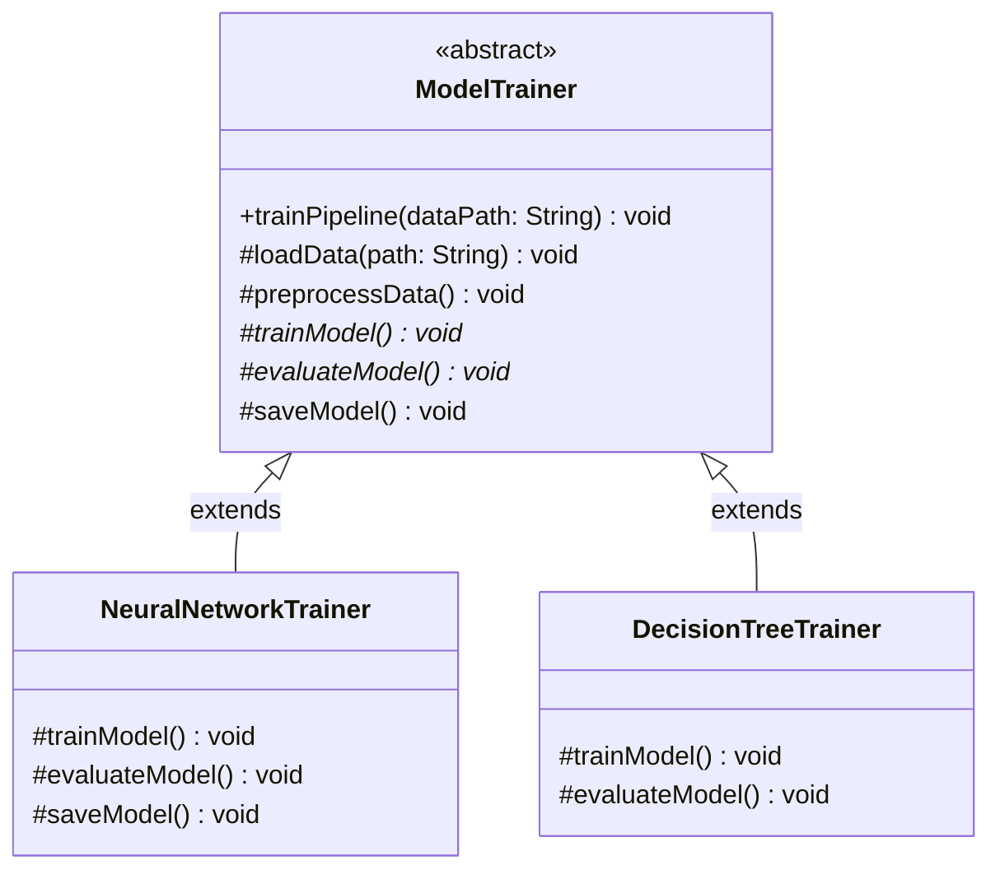

# 📝 Template Design Pattern:

The Template Design Pattern is a behavioral software design pattern that defines the skeleton of an algorithm in the superclass but lets subclasses override specific steps of the algorithm without changing its overarching structure.

In essence, if you have a workflow with fixed steps but varying internal details, the client code can execute a standardized sequence while the underlying subclasses handle the specific domain logic.

This repository demonstrates this concept using an automated machine learning workflow: **A Model Training Pipeline where all models must follow a strict sequence of loading data, preprocessing, training, evaluating, and saving**.

---

## 🏗️ Architecture & UML Diagram

The architecture centers around an abstract base class containing a `final` template method. This guarantees the sequence of execution while delegating specific steps to abstract methods that concrete subclasses must implement.

Below is the UML class diagram representing the `TemplatePatternDemo` architecture:

---

## 🧩 The Core Mechanics: How It Works

This implementation separates the algorithm into a rigid workflow and customizable steps to form a cohesive pipeline.

### 1. The Template Method (`trainPipeline`)

* **How it works:** This is a `final` method defined in the `ModelTrainer` base class that establishes the exact sequence: `loadData`, `preprocessData`, `trainModel`, `evaluateModel`, and `saveModel`.

* **The Goal:** Because the method is marked `final`, subclasses cannot alter or disrupt the training sequence, ensuring systemic consistency across all model types.

### 2. Common & Default Steps

* **How it works:** Protected methods like `loadData()` and `preprocessData()` are implemented in the base class to provide shared functionality, such as reading from a path or splitting data into train/test sets.

* **The Behavior:** The base class also provides a default implementation for `saveModel()`. Subclasses like `DecisionTreeTrainer` can inherit this default behavior directly, while others can override it if they require custom logic.

### 3. Subclass-Specific Steps (`trainModel`, `evaluateModel`)

* **How it works:** These steps are declared as `abstract` in the base class, which forces concrete subclasses to provide their own distinct implementations.

* **The Magic of Customization:** `NeuralNetworkTrainer` implements `trainModel()` to train for 100 epochs, and overrides `saveModel()` to serialize weights to an `.h5` file. Conversely, `DecisionTreeTrainer` implements `trainModel()` to build a tree with a `max_depth=5` and uses a classification report for its evaluation.

---

## 🛡️ SOLID Principles Analysis

Behavioral patterns like the Template pattern are highly effective at enforcing algorithmic structure while promoting code reuse and minimizing duplication.

### 1. Single Responsibility Principle (SRP) ✅

* The `ModelTrainer` class focuses solely on managing the overarching pipeline sequence.

* The subclass implementations (e.g., `NeuralNetworkTrainer`) strictly handle the specific algorithmic logic for training and evaluation.

### 2. Open/Closed Principle (OCP) ✅

* The core pipeline workflow is closed for modification because the `trainPipeline()` method cannot be overridden.

* The system remains open for extension; you can introduce new machine learning models easily by extending `ModelTrainer` without altering the existing base pipeline.

### 3. Liskov Substitution Principle (LSP) ✅

* The client (`TemplatePatternDemo`) can instantiate either a `NeuralNetworkTrainer` or a `DecisionTreeTrainer` and assign them to a `ModelTrainer` variable.

* When `trainPipeline()` is invoked on these instances, the program behaves correctly and predictably, proving the subclasses are perfectly substitutable for their parent class.

### 4. Dependency Inversion Principle (DIP) ✅

* The high-level execution logic (the pipeline sequence) relies on abstractions (the abstract method signatures) rather than specific low-level implementations.

* The concrete trainer classes implement these abstractions to fulfill the overarching contract established by the base class.