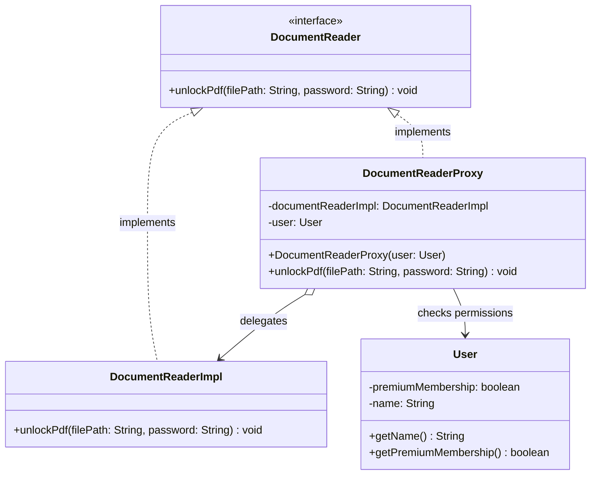
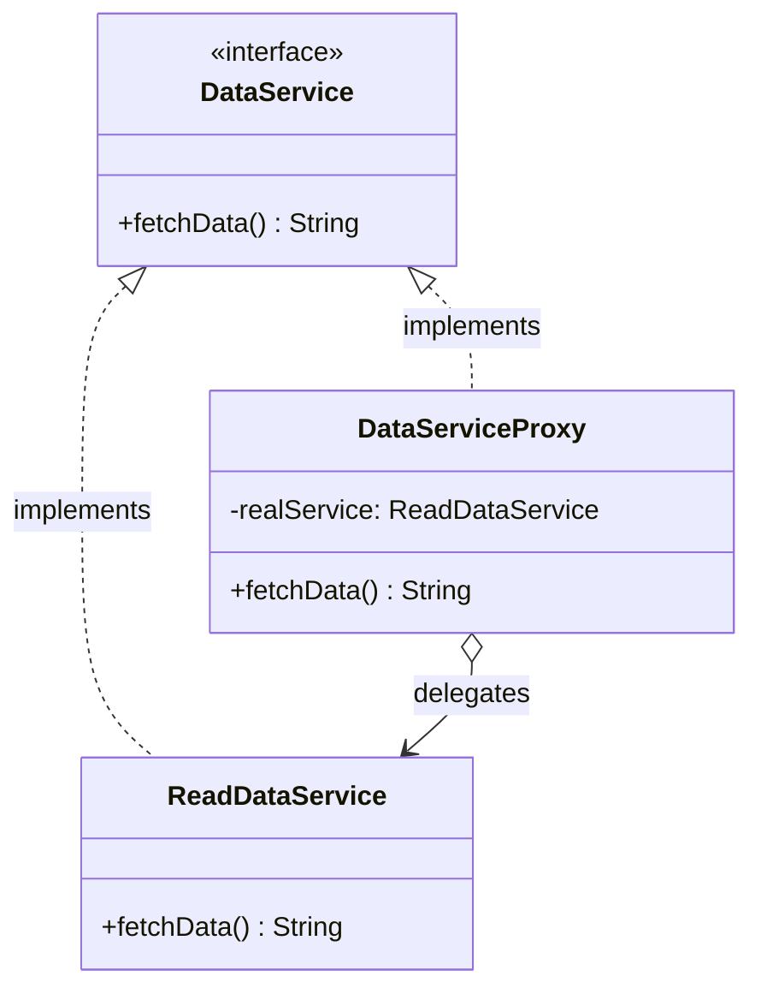
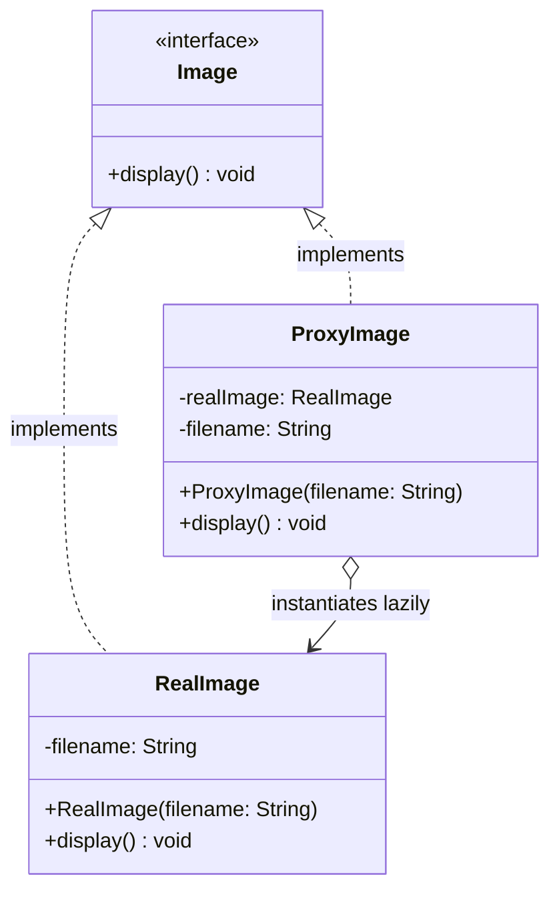

# 🛡️ Proxy Design Pattern: Structural Gatekeepers

The Proxy Design Pattern is a structural software design pattern that provides a surrogate or placeholder for another object to control access to it. It allows you to perform something either before or after the request gets through to the original object.

In essence, the client interacts with the proxy object, which implements the same interface as the real object. The proxy handles auxiliary responsibilities—such as access control, lazy initialization, or network connection—before delegating the core work to the real underlying service.

This repository demonstrates this concept using three common variations of the pattern: **Protection Proxy**, **Remote Proxy**, and **Virtual Proxy**.

---

## 🏗️ Architecture & UML Diagrams

Because this pattern has multiple variations based on the proxy's specific responsibility, the architecture is broken down into three distinct models. In all three models, both the Proxy and the Real Subject implement a shared interface, ensuring client compatibility.

### 1. Protection Proxy Diagram

This proxy controls access based on user permissions.

### 2. Remote Proxy Diagram

This proxy acts as a local representative for a service that exists in a different location or address space.

### 3. Virtual Proxy Diagram

This proxy manages the lifecycle of a resource-heavy object, deferring its creation until it is actually needed.

---

## 🧩 The Core Mechanics: How It Works

Each proxy variation intercepts the client's request to fulfill a specific administrative duty before passing the baton to the real subject.

### 1. The Protection Proxy (`DocumentReaderProxy`)

* **How it works:** The `DocumentReaderProxy` contains a reference to a `User` object and a `DocumentReaderImpl` object.

* **The Goal:** It acts as an authorization gatekeeper. When the client calls `unlockPdf()`, the proxy checks if the `User` has a premium membership (`!user.getPremiumMembership()`). If true, it delegates to the real `DocumentReaderImpl`; otherwise, it denies access and prompts an upgrade.

### 2. The Remote Proxy (`DataServiceProxy`)

* **How it works:** The `DataServiceProxy` implements the `DataService` interface and wraps the `ReadDataService`.

* **The Behavior:** Before fetching the actual data, the proxy mimics network operations (e.g., logging "Connecting to Remote Server..."). It abstracts the complexity of network communication away from the client, allowing the client to call `fetchData()` as if the resource were local.

### 3. The Virtual Proxy (`ProxyImage`)

* **How it works:** The `ProxyImage` acts as a placeholder for a resource-intensive `RealImage` object. The real image simulates a heavy loading process in its constructor (`System.out.println("[RealImage] Loading " + filename)`).

* **The Magic of Lazy Loading:** The proxy avoids creating the `RealImage` when the proxy itself is instantiated. Instead, it waits until the client explicitly calls the `display()` method. If the `realImage` is `null`, it finally instantiates it before calling `realImage.display()`.

---

## 🛡️ SOLID Principles Analysis

The Proxy pattern is highly effective at managing auxiliary responsibilities without cluttering the core business logic.

### 1. Single Responsibility Principle (SRP) ✅

Responsibilities are strictly separated:

* The real subjects (`DocumentReaderImpl`, `ReadDataService`, `RealImage`) focus purely on their primary tasks: unlocking files, fetching data, and rendering images.

* The proxies handle the secondary concerns: access control, simulated network logging, and lazy initialization.

### 2. Open/Closed Principle (OCP) ✅

You can introduce new proxies into the system without modifying the real subjects or the client code. For example, if you wanted to add a caching layer to the `DataService`, you could create a `CachingDataServiceProxy` that implements the same interface without altering `ReadDataService`.

### 3. Liskov Substitution Principle (LSP) ✅

Clients can interact seamlessly with either the proxy or the real subject because they both implement the exact same interface (`DocumentReader`, `DataService`, `Image`). The client code does not need to know whether it is dealing with a proxy or the actual object.

### 4. Dependency Inversion Principle (DIP) ✅

The client interacts with the systems via abstractions (`DocumentReader`, `DataService`, `Image`) rather than relying on the concrete `Impl`, `Read`, or `Real` classes. This dependency on interfaces is what makes substituting the proxy for the real object possible.