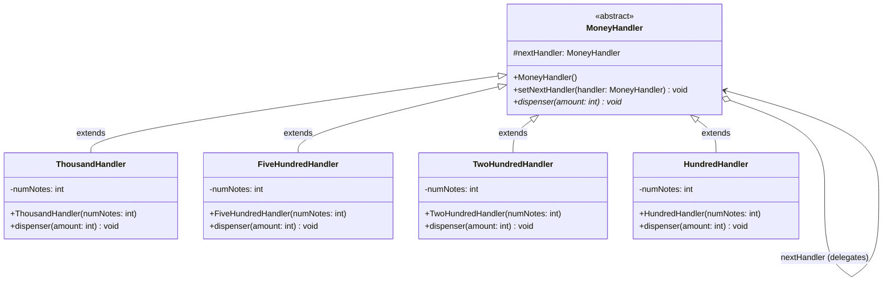

# 🔗 Chain of Responsibility Design Pattern:

The Chain of Responsibility Design Pattern is a behavioral software design pattern that lets you pass requests along a chain of handlers. Upon receiving a request, each handler decides either to process it partially/fully or to pass it to the next handler in the chain.

In essence, it decouples the sender of a request from its receiver by giving multiple objects a chance to handle the request. If one object cannot handle the complete request, it delegates the remaining work to the next link in the chain.

This repository demonstrates this concept using a classic real-world scenario: **An ATM Money Dispenser that breaks down a requested withdrawal amount into various currency denominations**.

---

## 🏗️ Architecture & UML Diagram

The architecture revolves around an abstract base handler that contains a reference to itself, allowing the creation of a linked list of handler objects. Each concrete handler extends this base class to process a specific denomination.

Below is the UML class diagram representing the `ChainOfResponsibilities` architecture:

---

## 🧩 The Core Mechanics: How It Works

This implementation breaks down the responsibility of dispensing cash into individual nodes, each representing a distinct currency bill.

### 1. The Abstract Handler (`MoneyHandler`)

* **How it works:** This abstract class forms the foundation of the chain. It maintains a `protected MoneyHandler nextHandler` property and provides a `setNextHandler()` method to establish the linkage.

* **The Goal:** It defines the abstract `dispenser(int amount)` method that all concrete subclasses must implement, ensuring a uniform way to process requests across the chain.

### 2. The Concrete Handlers (Denominations)

* **How it works:** Classes like `ThousandHandler`, `FiveHundredHandler`, `TwoHundredHandler`, and `HundredHandler` represent the physical cassettes in an ATM. Each is instantiated with a specific `numNotes` inventory.

* **The Behavior:** When `dispenser()` is called, the handler calculates how many of its specific notes it can provide using division (e.g., `amount / 1000`). It checks this requirement against its available `numNotes` inventory, updating its internal count accordingly. If notes are dispensed, it logs the action to the console.

### 3. The Chain Execution & Delegation

* **How it works:** The client instantiates the handlers and links them sequentially (1000 -> 500 -> 200 -> 100). The client then triggers the chain by calling `handler.dispenser(5000)` on the first node.

* **The Magic of Delegation:** After a handler processes what it can, it calculates the `remainingAmount`. If the `remainingAmount` is greater than zero and a `nextHandler` exists, it recursively delegates the remainder down the chain (`nextHandler.dispenser(remainingAmount)`). If the chain ends and money is still owed, it triggers a failure message indicating insufficient funds in the ATM.

---

## 🛡️ SOLID Principles Analysis

Behavioral patterns like the Chain of Responsibility are excellent for decoupling request senders from their processing logic, ensuring flexibility and maintainability.

### 1. Single Responsibility Principle (SRP) ✅

Each class has a highly focused job:

* `ThousandHandler` only worries about managing and calculating ₹1000 notes.

* It does not care how ₹500 or ₹100 notes are calculated, offloading that responsibility completely to the next links in the chain.

### 2. Open/Closed Principle (OCP) ✅

The dispensing logic is open for extension but closed for modification. If the bank introduces a new ₹2000 or ₹50 bill, you can simply create a new `TwoThousandHandler` or `FiftyHandler` extending `MoneyHandler`. You can then insert it anywhere into the chain using `setNextHandler()` without altering any of the existing handler classes.

### 3. Liskov Substitution Principle (LSP) ✅

The client can rely on the `MoneyHandler` abstraction uniformly. Any concrete handler (e.g., `HundredHandler`) can be substituted in as the `nextHandler` object or serve as the starting point of the chain without breaking the underlying logic.

### 4. Dependency Inversion Principle (DIP) ✅

The handlers do not depend on the concrete implementations of the other handlers. When `ThousandHandler` needs to pass the remaining amount along, it calls `nextHandler.dispenser()`, relying purely on the abstract `MoneyHandler` contract rather than a rigidly coupled class.