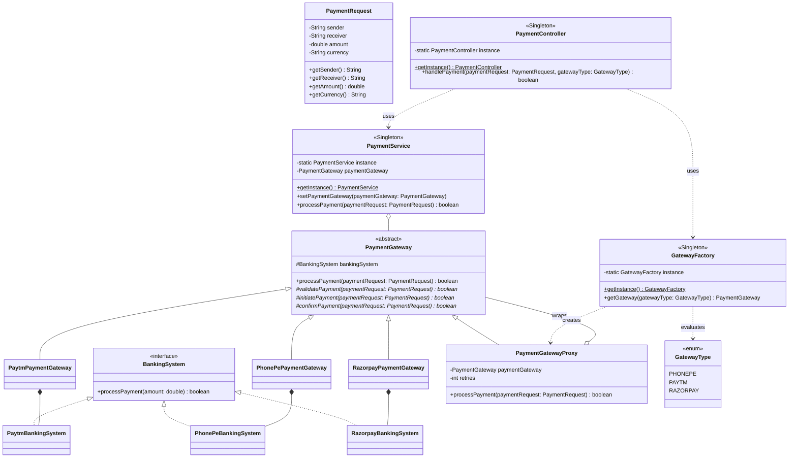

# 💳 Modular Payment Gateway Demonstration System:

## 1. System Overview

The **Modular Payment Gateway System** is a robust, object-oriented Java application that simulates a secure, multi-provider payment processing engine[cite: 1]. It mimics real-world backend payment orchestration architectures—handling unified transaction requests, routing transactions across multiple third-party banking networks (Paytm, PhonePe, Razorpay), managing automatic transaction retries, and providing a single centralized point of control for client requests[cite: 1].

The architecture is cleanly modularized, leveraging structural and behavioral design patterns to separate transaction workflows, validation rules, error handling, and concrete banking APIs[cite: 1].

### **Directory / Package Layout**
* **`models/`**: Contains pure data transfer elements (`PaymentRequest`)[cite: 1].
* **`systems/`**: Houses banking interfaces and third-party network adapters (`BankingSystem`, `PaytmBankingSystem`, etc.)[cite: 1].
* **`gateways/`**: Implements the core transaction pipeline via template methods (`PaymentGateway`, `PaytmPaymentGateway`, etc.)[cite: 1].
* **`proxy/`**: Manages cross-cutting transaction orchestration and fault tolerance (`PaymentGatewayProxy`)[cite: 1].
* **`factory/`**: Handles conditional creational logic (`GatewayFactory`)[cite: 1].
* **`services/` & `controllers/`**: Core application singleton layers coordinating API traffic (`PaymentService`, `PaymentController`)[cite: 1].

---

## 2. Architecture UML Diagram

Below is the visual UML class diagram illustrating class relationships, pattern integrations, and system flow across the application[cite: 1]:

---

## 3. Design Patterns Implemented

The codebase strategically incorporates five major software design patterns to ensure decoupling, scalability, and clean error recovery.

### **A. Template Method Pattern (Behavioral)**

* **Where it is used:** `PaymentGateway` (Abstract Class), along with `PaytmPaymentGateway`, `PhonePePaymentGateway`, and `RazorpayPaymentGateway`.

* **How it works:** The abstract base class defines the fixed workflow skeleton inside `processPayment(PaymentRequest)`: validation → initiation → confirmation. Concrete subclasses override the granular steps while keeping the transaction pipeline invariant.

* **Why it was used:** To enforce a consistent processing sequence across all integrated payment vendors while letting individual gateways specify customized validation and execution rules.

### **B. Proxy Pattern (Structural)**

* **Where it is used:** `PaymentGatewayProxy`.

* **How it works:** The proxy wraps the underlying `PaymentGateway` implementation and intercepts calls to `processPayment()`. It controls access by automatically injecting a loop-based retry mechanism if a transaction fails.

* **Why it was used:** To isolate fault-tolerance and retry behaviors from the core payment logic, keeping gateway classes clean and single-focused.

### **C. Simple Factory Pattern (Creational)**

* **Where it is used:** `GatewayFactory` (implemented as a Singleton).

* **How it works:** Evaluates the `GatewayType` enum and instantiates the matching concrete gateway wrapped dynamically inside a transaction `PaymentGatewayProxy`.

* **Why it was used:** To centralize object creation logic and shield client controllers from knowing about individual concrete gateway classes or proxy wrapper initialization.

### **D. Strategy Pattern (Behavioral)**

* **Where it is used:** `BankingSystem` interface and implementations (`PaytmBankingSystem`, `PhonePeBankingSystem`, `RazorpayBankingSystem`).

* **How it works:** Gateways delegate the core transaction execution down to an injected `BankingSystem` component.

* **Why it was used:** To allow individual payment gateways to swap or communicate with different banking infrastructure layers dynamically.

### **E. Singleton Pattern (Creational)**

* **Where it is used:** `GatewayFactory`, `PaymentService`, and `PaymentController`.

* **How it works:** Managed through private constructors and thread-safe instance accessors (`getInstance()`).

* **Why it was used:** To ensure uniform global access points for routing traffic, handling system requests, and creating gateway instances without redundant allocations.

---

## 4. SOLID Principles Analysis

The system demonstrates clean adherence to object-oriented principles, though certain trade-offs exist regarding string comparisons and error propagation.

### **1. Single Responsibility Principle (SRP)**

* **Followed:** `PaymentRequest` handles purely data payload management, while `PaymentController` acts strictly as an entry routing coordinator.

* **Trade-off:** Concrete gateways handle both validation logic and execution flow, though the Template Method pattern helps keep these responsibilities cleanly separated into distinct override steps.

### **2. Open/Closed Principle (OCP)**

* **Followed:** Adding a new payment provider requires only creating a new gateway and `BankingSystem` subclass, without modifying existing gateway templates.

* **Violation:** The `GatewayFactory` uses conditional `if-else` routing logic. Introducing a new gateway type forces a modification inside the factory's selection block.

### **3. Liskov Substitution Principle (LSP)**

* **Followed:** Any concrete gateway subclass (`PaytmPaymentGateway`, `PhonePePaymentGateway`, etc.) or proxy wrapper can be substituted seamlessly anywhere a `PaymentGateway` base type is expected.

### **4. Interface Segregation Principle (ISP)**

* **Followed:** The `BankingSystem` interface is minimal and laser-focused, exposing a single core requirement: `processPayment(double amount)`.

### **5. Dependency Inversion Principle (DIP)**

* **Followed:** High-level execution controllers and services depend on abstractions (`PaymentGateway` and `BankingSystem`), minimizing tight coupling to low-level third-party provider specifics.

---

## 5. Architectural Vulnerabilities & Future Improvements

1. **String Equality Comparison for Currency:**
* **Current Issue:** Validation checks use reference equality (`paymentRequest.getCurrency() != "INR"`) instead of value-based comparison (`!paymentRequest.getCurrency().equals("INR")`).

* **Fix:** Refactor string evaluations to use `.equals()` to avoid unexpected logical failures in Java.

2. **Hardcoded Configuration Values:**
* **Current Issue:** Retry counts (e.g., `3`) and random failure thresholds inside banking simulations are hardcoded directly into class files.

* **Fix:** Extract these parameters into an external configuration file or environment properties manager.

3. **Absence of Custom Exception Handling:**
* **Current Issue:** Errors are communicated strictly through boolean status returns and console prints.

* **Fix:** Implement a robust custom exception hierarchy (e.g., `InvalidCurrencyException`, `GatewayTimeoutException`) for better error categorization.