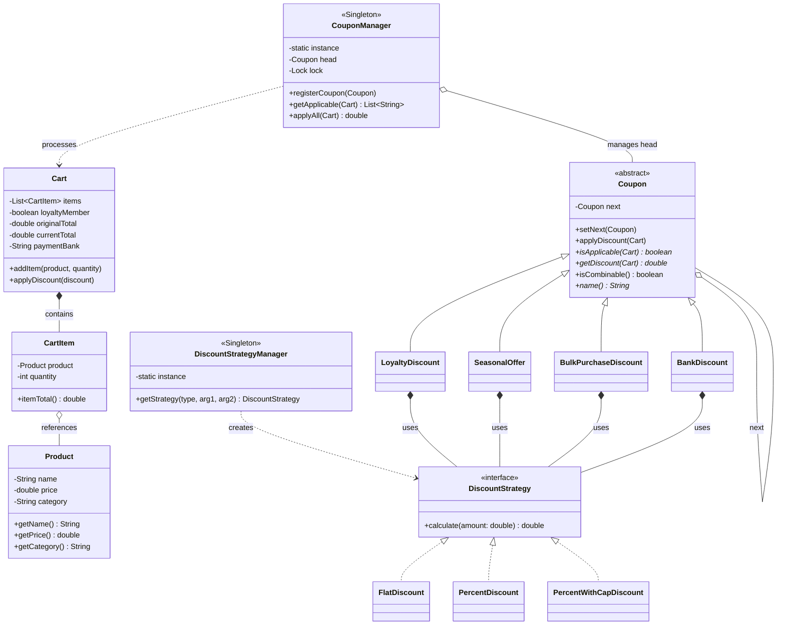

# 🛒 Discount Coupon Management System

## 1. System Overview

The **Discount Coupon Management System** is an object-oriented Java application designed to simulate a flexible, rule-based pricing and discount engine for e-commerce platforms. It handles the orchestration of multiple promotional offers—such as seasonal sales, loyalty rewards, bank-specific discounts, and bulk purchase thresholds—applying them sequentially to a customer's shopping cart.

The architecture heavily relies on behavioral and creational design patterns to separate the mathematical discount logic from the evaluation rules, ensuring a modular and thread-safe environment for processing transactions.

### **Logical Component Layout**

* **`Models`**: Contains the pure data structures (`Product`, `CartItem`, `Cart`) representing the e-commerce entities.

* **`Strategies`**: Houses the mathematical discount calculations (`DiscountStrategy`, `FlatDiscount`, `PercentDiscount`, `PercentWithCapDiscount`).

* **`Coupons`**: Implements the evaluation nodes for the processing pipeline (`Coupon`, `LoyaltyDiscount`, `SeasonalOffer`, `BulkPurchaseDiscount`, `BankDiscount`).

* **`Managers`**: Core singleton controllers that orchestrate thread-safe coupon registration and strategy instantiation (`CouponManager`, `DiscountStrategyManager`).

---

## 2. Architecture UML Diagram

Below is the visual UML class diagram illustrating the class relationships, design pattern integrations, and object flow across the system:

---

## 3. Design Patterns Implemented

The codebase strategically incorporates several software design patterns to ensure scalability, clean rule separation, and thread safety.

### **A. Chain of Responsibility Pattern (Behavioral)**

* **Where it is used:** The `Coupon` abstract base class and its subclasses.

* **How it works:** Each `Coupon` maintains a reference to the `next` coupon in the hierarchy. When `applyDiscount(Cart)` is called, the current coupon evaluates if it applies, deducts the amount, and then delegates the cart to the next coupon in the linked list.

* **Why it was used:** To allow multiple, independent discount rules to process the same cart sequentially without hardcoding a massive, monolithic evaluation method.

### **B. Strategy Pattern (Behavioral)**

* **Where it is used:** `DiscountStrategy` interface and its concrete implementations (`FlatDiscount`, `PercentDiscount`, `PercentWithCapDiscount`).

* **How it works:** Encapsulates the specific mathematical formula used to calculate a discount. Concrete coupons delegate the final math to these injected strategy objects.

* **Why it was used:** To decouple the business logic of *when* a discount applies (handled by the Coupon) from the mathematical logic of *how much* it calculates (handled by the Strategy).

### **C. Singleton Pattern (Creational)**

* **Where it is used:** `DiscountStrategyManager` and `CouponManager`.

* **How it works:** Managed through private constructors, static instances, and `synchronized` accessors (`getInstance()`).

* **Why it was used:** To provide a single, global, thread-safe registry for active coupons and a unified factory for generating strategies.

### **D. Simple Factory Pattern (Creational)**

* **Where it is used:** `DiscountStrategyManager`.

* **How it works:** Uses the `getStrategy()` method to evaluate a `StrategyType` enum (FLAT, PERCENT, PERCENT_WITH_CAP) and instantiates the correct strategy object dynamically.

* **Why it was used:** To centralize object creation logic and prevent the concrete Coupon classes from needing to understand how to instantiate mathematical strategies directly.

---

## 4. SOLID Principles Analysis

### **1. Single Responsibility Principle (SRP)**

* **Followed:** `Cart` and `CartItem` manage state and totals, `DiscountStrategy` executes math, and `Coupon` validates business rules.

* **Trade-off:** `CouponManager` acts as both a linked-list builder (`registerCoupon`) and an execution trigger (`applyAll`), slightly blurring its primary responsibility.

### **2. Open/Closed Principle (OCP)**

* **Followed:** Adding a new promotional rule (e.g., `NewUserDiscount`) simply requires extending the `Coupon` class and registering it, without altering existing coupon logic or the manager.

* **Violation:** The `DiscountStrategyManager` utilizes an `if-else` block to evaluate the `StrategyType` enum. Adding a new math strategy requires modifying this block directly.

### **3. Liskov Substitution Principle (LSP)**

* **Followed:** Any concrete coupon (`SeasonalOffer`, `BankDiscount`) can seamlessly substitute the base `Coupon` node within the `CouponManager`'s execution chain.

### **4. Dependency Inversion Principle (DIP)**

* **Followed:** Concrete coupons rely entirely on the `DiscountStrategy` abstraction to perform mathematical deductions rather than depending on concrete math implementations.

---

## 5. Architectural Vulnerabilities & Future Improvements

1. **Floating-Point Precision for Currency:**
* **Current Issue:** The application utilizes `double` primitive types for all monetary values (`price`, `amount`, `currentTotal`). This can lead to rounding errors in high-volume financial calculations.

* **Fix:** Refactor all monetary fields and calculations to utilize `java.math.BigDecimal` for guaranteed precision.

2. **Hardcoded String Classifications:**
* **Current Issue:** Product categories (e.g., `"Clothing"`, `"Electronics"`) and Bank IDs (e.g., `"ABC"`) are instantiated as raw strings.

* **Fix:** Implement explicit `Enum` types for categories and banking partners to ensure type safety and prevent typographical errors.

3. **Inflexible Combinability Logic:**
* **Current Issue:** The `isCombinable()` method in the base `Coupon` class defaults to `true` and is not explicitly overridden or utilized dynamically by the subclasses in this demo. If a coupon returns `false`, it halts the chain prematurely rather than intelligently sorting the best combination.

* **Fix:** Implement a more advanced rules engine or sorting algorithm that evaluates all permutations of applicable discounts to guarantee the customer the maximum allowed benefit.