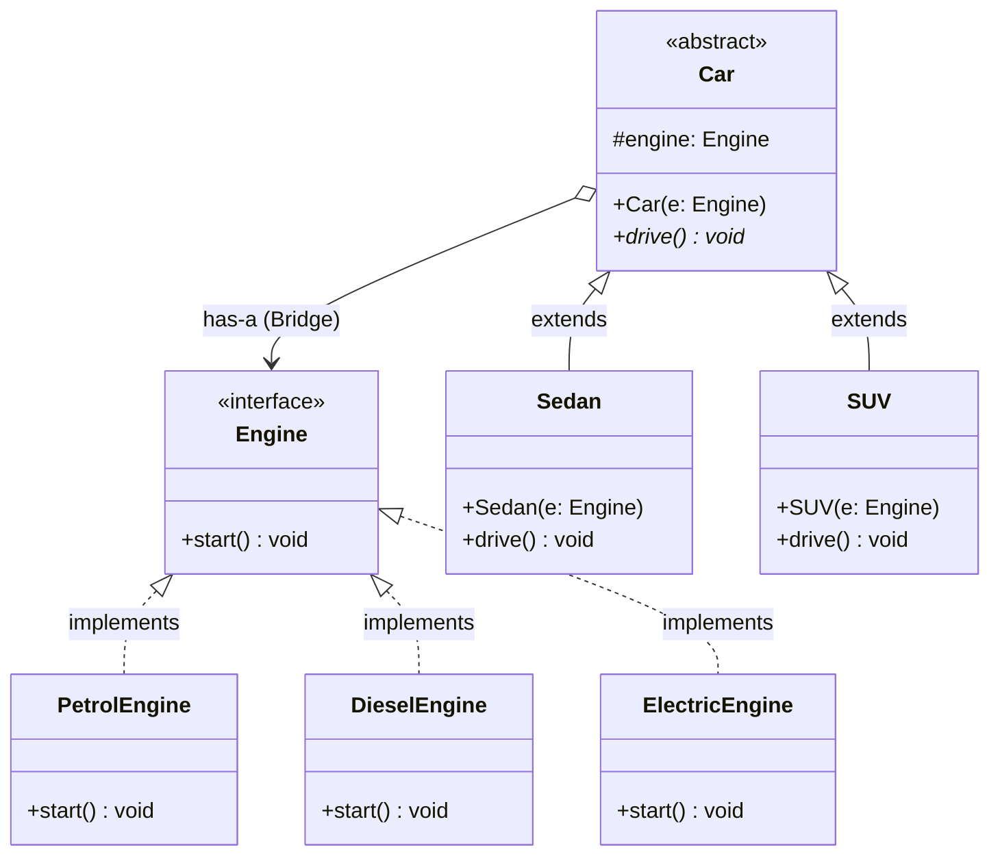

# 🌉 Bridge Design Pattern:

The Bridge Design Pattern is a structural software design pattern that decouples an abstraction from its implementation so that the two can vary independently. Instead of using inheritance to combine different features (which often leads to an exponentially growing Cartesian product of classes), the Bridge pattern uses object composition.

In this repository, the pattern is demonstrated by separating the high-level logic (the type of vehicle) from the low-level logic (the type of engine).

---

## 🏗️ Architecture & UML Diagram

The architecture is split into two distinct hierarchies: the **Abstraction Hierarchy** (Cars) and the **Implementation Hierarchy** (Engines). The `Car` acts as the abstraction that maintains a reference to the `Engine` implementor, serving as the "bridge" between the two.

---

## 🧩 The Core Mechanics: How It Works

This system avoids creating classes like `PetrolSedan` or `ElectricSUV` by cleanly dividing responsibilities.

### 1. The Implementation (Low-Level Logic)

* **How it works:** The `Engine` interface dictates the contract for all engine types with a `start()` method.

* **Concrete Implementors:** `PetrolEngine`, `DieselEngine`, and `ElectricEngine` implement this interface, providing specific string outputs (e.g., `"Electric engine powering up silently!"`) when the engine starts.

### 2. The Abstraction (High-Level Logic)

* **How it works:** The `Car` is an abstract class that represents the overarching entity. It holds a `protected Engine engine` field.

* **Refined Abstractions:** `Sedan` and `SUV` extend `Car` and define the specific vehicle behaviors by implementing the abstract `drive()` method. For example, the `SUV`'s `drive()` method delegates to `engine.start()` before printing `"Driving an SUV off-road."`.

### 3. The Bridge (Dependency Injection)

* **How it works:** The actual "bridge" is formed during object creation inside the `BridgePatternDemo` client.

* **The Execution:** When instantiating a car (like `mySedan`), the client injects the specific engine implementation (like `petrolEng`) via the `Car` constructor (`new Sedan(petrolEng)`). This allows `mySedan.drive()` to trigger the petrol engine's start sequence alongside the sedan's driving behavior.

---

## 🛡️ SOLID Principles Analysis

The Bridge pattern is an excellent showcase of robust, object-oriented design principles.

### 1. Single Responsibility Principle (SRP)

* **Followed:** The code strictly separates concerns. The `Car` subclasses only care about vehicle-specific logic (highway vs. off-road driving), while the `Engine` classes only handle ignition and power mechanisms.

### 2. Open/Closed Principle (OCP)

* **Followed:** You can introduce new vehicle types (e.g., `Truck`) or new engine types (e.g., `HybridEngine`) completely independently without altering the existing classes.

### 3. Liskov Substitution Principle (LSP)

* **Followed:** Inside the `BridgePatternDemo`, any concrete engine (`ElectricEngine`, `DieselEngine`) can be seamlessly substituted into the `Car` constructor wherever the `Engine` interface is required.

### 4. Dependency Inversion Principle (DIP)

* **Followed:** The high-level module (`Car`) does not depend on low-level modules (like `PetrolEngine`). Instead, `Car` depends solely on the `Engine` abstraction. Both high-level logic and low-level logic rely entirely on interfaces and abstract classes.