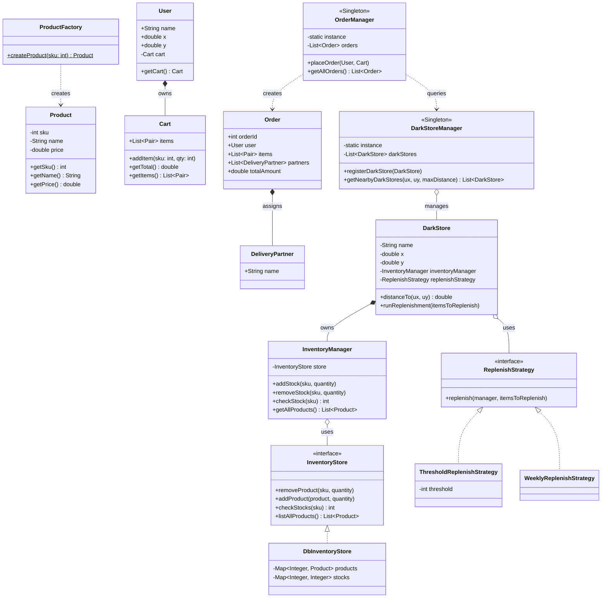

# 🛒 Quick Commerce & Inventory Management System

## 1. System Overview

The **Quick Commerce & Inventory Management System** (Zepto-like demo) is an object-oriented Java application built to simulate a fast-delivery e-commerce platform. It handles user shopping carts, multi-store inventory tracking, spatial store-matching, and complex order routing where fulfillment can be split across multiple delivery partners.

The architecture utilizes a decentralized store model, relying on strategic design patterns to manage stock replenishment, product instantiation, and centralized order processing.

### **Logical Component Layout**

* **`Models`**: Contains the primary data structures including `Product`, `Cart`, `User`, `Order`, and `DeliveryPartner`.

* **`Stores & Inventory`**: Houses the inventory logic through the `InventoryStore` interface, its concrete `DbInventoryStore` implementation, and the `InventoryManager` and `DarkStore` classes.

* **`Strategies`**: Contains the algorithms for inventory restocks utilizing the `ReplenishStrategy` interface, alongside its concrete implementations `ThresholdReplenishStrategy` and `WeeklyReplenishStrategy`.

* **`Managers`**: Core singleton controllers, specifically `DarkStoreManager` and `OrderManager`, which orchestrate nearby store lookups and order placements.

* **`Factories`**: Contains the `ProductFactory` responsible for generating product entities based on SKU IDs.

---

## 2. Architecture UML Diagram

Below is the visual UML class diagram illustrating the class relationships, design pattern integrations, and object flow across the system based on the provided Java implementation:

---

## 3. Design Patterns Implemented

The codebase strategically incorporates several software design patterns to ensure clean separation of inventory tracking, order routing, and instantiation.

### **A. Strategy Pattern (Behavioral)**

* **Where it is used:** The `ReplenishStrategy` interface and its implementations (`ThresholdReplenishStrategy`, `WeeklyReplenishStrategy`).

* **How it works:** Encapsulates the specific rules for restocking inventory. The `DarkStore` class maintains a reference to a `ReplenishStrategy` and calls its `replenish()` method dynamically.

* **Why it was used:** It allows the system to change how a store replenishes items (e.g., threshold-based vs. time-based) without modifying the `DarkStore` class directly.

### **B. Singleton Pattern (Creational)**

* **Where it is used:** `DarkStoreManager` and `OrderManager`.

* **How it works:** Managed through private constructors, static instances, and `getInstance()` accessor methods.

* **Why it was used:** Provides a single, global registry to track all available dark stores and manage all active orders across the application.

### **C. Simple Factory Pattern (Creational)**

* **Where it is used:** `ProductFactory`.

* **How it works:** Exposes a static `createProduct(int sku)` method that translates an integer SKU into a fully instantiated `Product` object with a name and price.

* **Why it was used:** Centralizes object creation logic, preventing external classes like `Cart` or `OrderManager` from needing to know the specific pricing and naming details for items like "Apple", "Banana", or "Jeans".

---

## 4. SOLID Principles Analysis

### **1. Single Responsibility Principle (SRP)**

* **Followed:** The `InventoryManager` handles high-level stock operations, while the underlying data storage and retrieval logic is strictly managed by the `DbInventoryStore`. `Cart` manages line items, and `OrderManager` executes checkout logic.

### **2. Open/Closed Principle (OCP)**

* **Followed:** Adding a new inventory replenishment algorithm simply requires creating a new class that implements `ReplenishStrategy`, without altering existing dark store logic.

* **Violation:** The `ProductFactory` utilizes an `if-else` block to resolve SKUs to product names and prices. Adding a new product requires modifying this block directly.

### **3. Dependency Inversion Principle (DIP)**

* **Followed:** The `InventoryManager` depends on the `InventoryStore` interface rather than the concrete `DbInventoryStore` implementation.

---

## 5. Architectural Vulnerabilities & Future Improvements

Based on the provided implementation, here are potential vulnerabilities and areas for system enhancement:

1. **Lack of Synchronization in Singletons:**
* **Current Issue:** The `getInstance()` methods in `DarkStoreManager` and `OrderManager` check if the instance is null and instantiate it without thread-locking. This can lead to race conditions and multiple singleton instances in a multi-threaded environment.

* **Fix:** Introduce `synchronized` blocks or leverage double-checked locking inside the `getInstance()` methods to ensure thread safety.

2. **Hardcoded Routing Thresholds:**
* **Current Issue:** The `OrderManager` class hardcodes the maximum delivery radius to `5.0` kilometers during the order placement process.

* **Fix:** Abstract spatial parameters into a configuration file or pass them as dynamic environment variables to support scalable, city-specific routing constraints.

3. **Floating-Point Coordinates and Financials:**
* **Current Issue:** Spatial coordinates (`x`, `y`) and currency values (`price`, `totalAmount`) utilize primitive `double` data types.

* **Fix:** Utilize `java.math.BigDecimal` for financial totals to avoid rounding inaccuracies, and consider dedicated geolocation objects (e.g., GeoJSON) for precision routing.