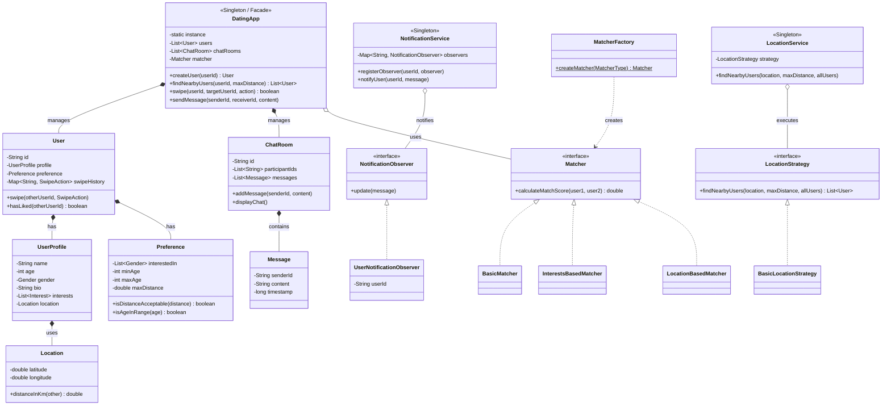

# 💖 Dating App Design:

## 1. System Overview

The **Dating App System** is an object-oriented Java application that simulates the core functionalities of a location-based social search and dating platform. It facilitates user onboarding, preference-based matching, bidirectional swiping, and real-time chat interactions.

The application utilizes the Haversine formula to calculate the geographical distance between users based on their coordinates. The formula calculates the distance $d$ using the Earth's radius $R = 6371.0$ km, latitude differences $\Delta \text{lat}$, and longitude differences $\Delta \text{lon}$:

$$a = \sin^2\left(\frac{\Delta \text{lat}}{2}\right) + \cos(\text{lat}_1) \cdot \cos(\text{lat}_2) \cdot \sin^2\left(\frac{\Delta \text{lon}}{2}\right)$$

$$c = 2 \cdot \text{atan2}(\sqrt{a}, \sqrt{1-a})$$

$$d = R \cdot c$$

The system's architecture relies heavily on a combination of behavioral, creational, and structural design patterns to ensure high modularity and separation of concerns.

---

## 2. Architecture UML Diagram

Below is a visual representation of the class relationships, domain models, and design patterns utilized within the application:

---

## 3. Design Patterns Implemented

The application leverages five primary software design patterns to manage its complexity.

### **A. Facade Pattern (Structural)**

* **Where it is used:** The `DatingApp` class.

* **How it works:** It provides a simplified, unified interface to the complex subsystems (matching, location parsing, chat rooms, and users).

* **Why it was used:** To allow the client (e.g., the `TinderClone` main method) to interact with the system without needing to manually orchestrate internal services like `LocationService` or `NotificationService`.

### **B. Observer Pattern (Behavioral)**

* **Where it is used:** `NotificationService`, `NotificationObserver`, and `UserNotificationObserver`.

* **How it works:** Users register their `UserNotificationObserver` upon creation. When a match occurs or a new message is received, the system triggers `update()` on the respective user's observer.

* **Why it was used:** To decouple the core application logic (swiping/chatting) from the notification delivery mechanism.

### **C. Strategy Pattern (Behavioral)**

* **Where it is used:** `LocationStrategy` interface and `LocationService`.

* **How it works:** The location algorithm is encapsulated inside `BasicLocationStrategy`, allowing the `LocationService` to execute searches without hardcoding the filtering logic.

* **Why it was used:** To allow the system to easily swap location-finding algorithms (e.g., switching from basic Haversine radius to a more complex geospatial index) at runtime.

### **D. Factory Pattern (Creational)**

* **Where it is used:** `MatcherFactory`.

* **How it works:** Provides a static `createMatcher()` method that evaluates a `MatcherType` enum to instantiate a `BasicMatcher`, `InterestsBasedMatcher`, or `LocationBasedMatcher`.

* **Why it was used:** To abstract the instantiation logic of scoring algorithms away from the `DatingApp` facade.

### **E. Singleton Pattern (Creational)**

* **Where it is used:** `DatingApp`, `LocationService`, and `NotificationService`.

* **How it works:** Implemented via private constructors and static `getInstance()` methods.

* **Why it was used:** To ensure only one global instance of these core services exists across the application's lifecycle.

---

## 4. SOLID Principles Analysis

* **Single Responsibility Principle (SRP):**
* **Followed:** Distinct domains are separated cleanly. For example, `ChatRoom` solely manages messages, `Location` manages coordinates and distances, and `Preference` handles matching constraints.

* **Open/Closed Principle (OCP):**
* **Followed:** The `Matcher` and `LocationStrategy` interfaces allow developers to add new scoring or locating algorithms without modifying the core consumer classes.

* **Violation:** The `MatcherFactory` relies on a `switch` statement for the `MatcherType` enum. Adding a new matcher requires directly modifying this factory class.

* **Dependency Inversion Principle (DIP):**
* **Followed:** The `LocationService` and `DatingApp` depend on the abstract `LocationStrategy` and `Matcher` interfaces, rather than concrete implementations.

---

## 5. Architectural Vulnerabilities & Future Improvements

1. **Thread Safety on Singletons & Collections:**
* **Current Issue:** Singletons (`getInstance()`) use lazy instantiation without synchronization, and collections (like `users` and `chatRooms`) utilize standard `ArrayList` implementations. This is not thread-safe in a highly concurrent environment like a dating server.

* **Fix:** Utilize double-checked locking for singletons and migrate lists to `CopyOnWriteArrayList` or synchronized collections.

2. **In-Memory Data Loss:**
* **Current Issue:** All user profiles, swipe histories (`Map<String, SwipeAction>`), and chat logs are stored strictly in memory. A server restart will result in total data loss.

* **Fix:** Introduce Data Access Objects (DAOs) and a persistence layer (e.g., PostgreSQL or MongoDB) to back up application state.