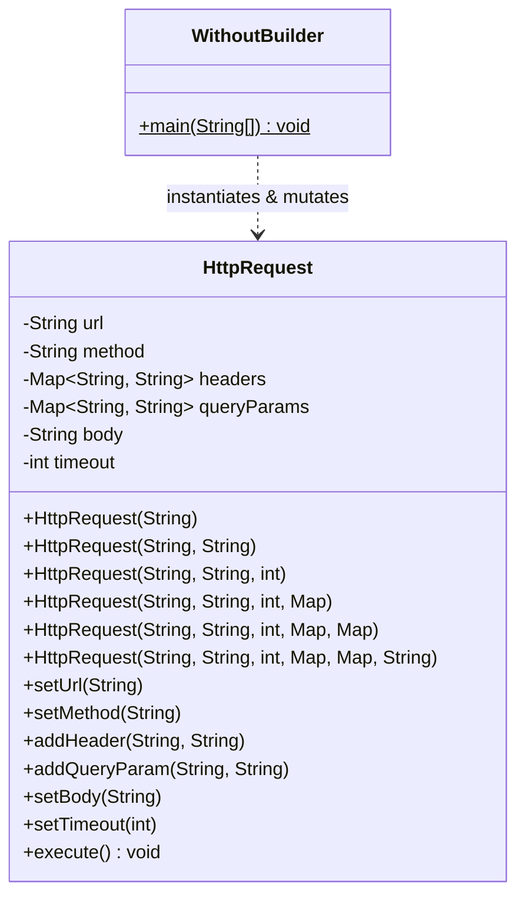
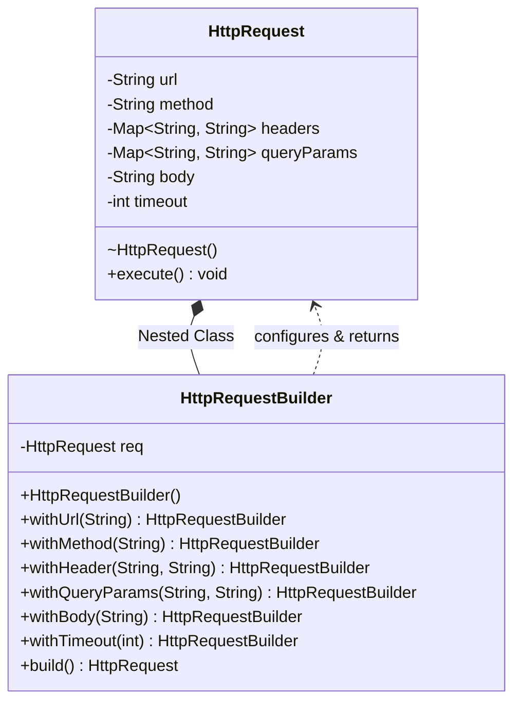
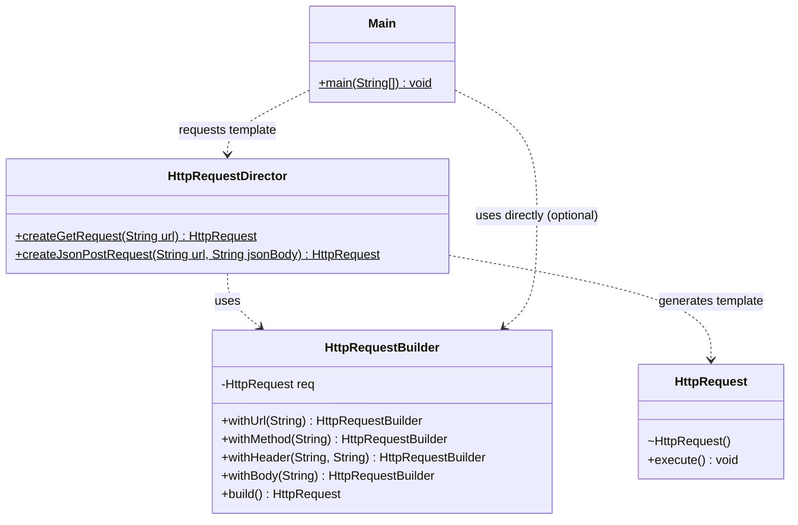
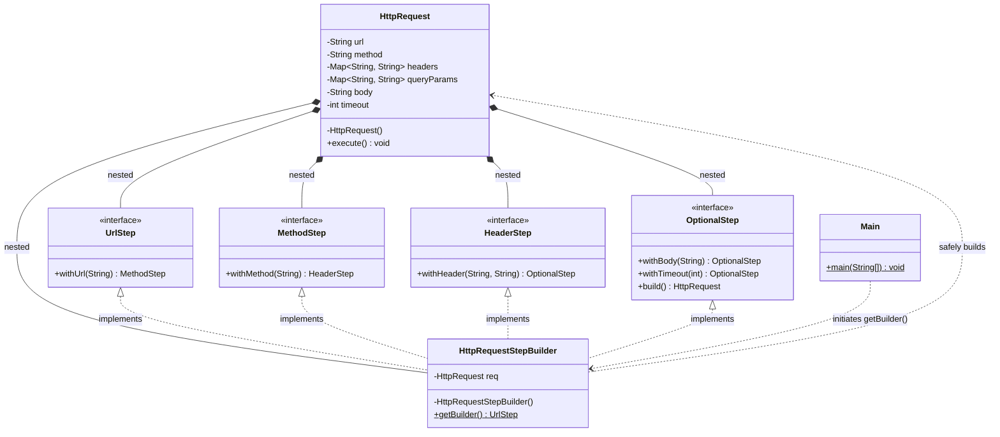

# 🏗️ Builder Design Pattern:

## 1. System Overview

The **Builder Design Pattern** is a creational design pattern designed to construct complex objects step by step. It separates the construction of a complex object from its representation, allowing the same construction process to create various representations.

In enterprise software, it is heavily used to configure objects that require numerous parameters, many of which might be optional. Real-world applications include building HTTP requests, configuring database connections, or generating complex UI components.

This repository tracks the evolution of object construction through four distinct architectural stages, addressing the critical challenges of telescoping constructors, object mutability, and mandatory parameter enforcement.

---

## 2. The Evolution: Four Stages of Object Creation & Architecture

Constructing objects with numerous fields usually starts simply but quickly degrades into unmaintainable code. Below is the breakdown of the solution into four stages, complete with functional architectural UML diagrams for each step.

### Stage 1: Without Builder (The Anti-Pattern)

* **What it is:** Using standard instantiation techniques as seen in `WithoutBuilder.java`.

* **The Flaw (Telescoping Constructors):** Requires maintaining multiple constructors to handle different parameter combinations (e.g., constructors with 1, 2, 3, 4, 5, and 6 arguments).

* **The Flaw (Mutability):** Alternatively, it uses a default constructor paired with setter methods like `setMethod()` and `setTimeout()`. This leads to a mutable object problem where a developer might forget to set a critical field before calling `execute()`, resulting in a runtime failure or an inconsistent state.

---

### Stage 2: The Simple Builder

* **What it is:** A nested `HttpRequestBuilder` class is introduced. The `HttpRequest` constructor is made package-private or private, forcing all instantiation through the builder.
* **The Benefit:** It utilizes method chaining (`.withUrl().withMethod()`) to clearly define what is being set.
* **The Fix:** The `build()` method acts as a final validation checkpoint. Once `build()` is executed, it returns a fully configured, immutable `HttpRequest` object, guaranteeing a consistent state.

---

### Stage 3: Builder with Director

* **What it is:** The `HttpRequestDirector` class is layered on top of the builder.
* **The Benefit:** It encapsulates repetitive, boilerplate construction logic. Instead of manually applying JSON headers and POST methods every time, the client simply calls `HttpRequestDirector.createJsonPostRequest(url, jsonBody)`.
* **The Use Case:** Ideal for SDKs and enterprise libraries where clients need standardized, pre-packaged request templates without worrying about the underlying builder configuration.

---

### Stage 4: The Step Builder (Guided Construction)

* **What it is:** Located in the `stepBuilder` package, this approach enforces the exact order of object construction.

* **How it works:** It utilizes nested interfaces (`UrlStep`, `MethodStep`, `HeaderStep`, `OptionalStep`). Calling `withUrl()` returns a `MethodStep`, which forces the developer to call `withMethod()` next.

* **The Benefit:** Compile-time safety. The `build()` method is exclusively available inside the `OptionalStep` interface. It is structurally impossible for a developer to build an HTTP request in `stepBuilder.Main.java` without first providing the mandatory URL and Method.

---

## 3. SOLID Principles Analysis

The Builder Pattern is highly regarded because it strictly enforces clean architectural principles.

### 1. Single Responsibility Principle (SRP)

* **Followed:** The `HttpRequest` class has only one responsibility: holding the network data and executing the HTTP call. It delegates the complex logic of data validation and assembly entirely to the `HttpRequestBuilder` and `HttpRequestStepBuilder`.

### 2. Open/Closed Principle (OCP)

* **Followed:** You can introduce new types of configurations or entirely new Director templates without modifying the underlying `HttpRequest` class or breaking existing client code.

### 3. Dependency Inversion Principle (DIP)

* **Followed (in Stage 4):** By utilizing the Step Builder pattern, the client code depends entirely on abstract interfaces (`UrlStep`, `MethodStep`) rather than the concrete builder implementation.