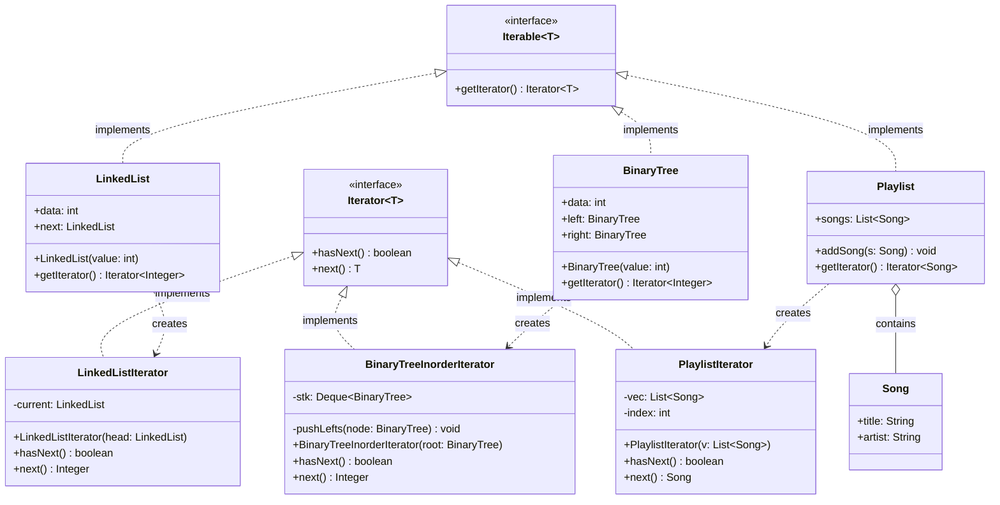

# 🔗 Iterator Design Pattern:

The Iterator Design Pattern is a behavioral software design pattern that lets you traverse the elements of a collection without exposing its underlying representation (list, stack, tree, etc.).

In essence, it decouples the traversal algorithms from the data structures themselves. It achieves this by extracting the traversal behavior of a collection into a separate object called an iterator, providing a uniform interface for iterating over various types of collections.

This repository demonstrates this concept using three distinctly different data structures: **A Singly Linked List, a Binary Tree (traversed in-order), and a Playlist of Songs**.

---

## 🏗️ Architecture & UML Diagram

The architecture revolves around two core interfaces: `Iterator<T>` and `Iterable<T>`. Each distinct data structure implements `Iterable<T>` to return a specific, concrete `Iterator<T>` designed uniquely for its traversal needs.

Below is the UML class diagram representing the `Iterator` architecture demonstrated in the code:

---

## 🧩 The Core Mechanics: How It Works

This implementation extracts the looping and traversal logic out of the data structures and places them into dedicated iterator classes.

### 1. The Core Interfaces (`Iterator` & `Iterable`)

* **How it works:** The `Iterator<T>` interface establishes the contract for traversal by defining `hasNext()` and `next()` methods.

* **The Goal:** The `Iterable<T>` interface guarantees that any collection implementing it can produce a valid iterator via the `getIterator()` method.

### 2. The Concrete Collections

* **How it works:** Classes like `LinkedList`, `BinaryTree`, and `Playlist` act as the data containers.

* **The Behavior:** Instead of writing custom loops to expose their internal nodes or arrays, they simply instantiate and return their specific iterator classes (e.g., `LinkedList` returns a new `LinkedListIterator`).

### 3. The Concrete Iterators

* **How it works:** These classes handle the complex, structure-specific traversal logic internally:
* `LinkedListIterator` uses a simple pointer (`current = current.next`) to walk through the linked nodes.

* `BinaryTreeInorderIterator` utilizes a stack (`Deque<BinaryTree>`) and a helper method (`pushLefts`) to systematically yield nodes in an in-order (Left-Root-Right) sequence.

* `PlaylistIterator` relies on a standard integer `index` to sequentially access items in the underlying `ArrayList`.

### 4. The Client Execution

* **How it works:** The main application creates the collections (a list of 1→2→3, a tree with root 2, left 1, right 3, and a playlist of songs).

* **The Magic of Uniformity:** The client retrieves an `Iterator` for each collection. It then uses the exact same standard `while(iterator.hasNext())` loop to print the contents of a Linked List, a Binary Tree, and a Playlist, completely oblivious to how the data is actually structured under the hood.

---

## 🛡️ SOLID Principles Analysis

Behavioral patterns like the Iterator are highly effective for maintaining clean, modular, and easily extensible codebases.

### 1. Single Responsibility Principle (SRP) ✅

Responsibilities are strictly separated:

* The collections (`BinaryTree`, `Playlist`, etc.) are solely responsible for data storage and structural integrity.

* The iterators (`BinaryTreeInorderIterator`, `PlaylistIterator`, etc.) are solely responsible for keeping track of the traversal state and logic.

### 2. Open/Closed Principle (OCP) ✅

The application is open for extension but closed for modification. If you wanted to add a `Graph` data structure or a new `BinaryTreePreorderIterator`, you can simply create new classes implementing `Iterable` and `Iterator` without touching the existing list, tree, or playlist code.

### 3. Liskov Substitution Principle (LSP) ✅

The client code relies exclusively on the `Iterator<T>` abstraction. Any concrete iterator (`LinkedListIterator`, `PlaylistIterator`) can be seamlessly substituted into the client's `while` loop without breaking the application's behavior.

### 4. Dependency Inversion Principle (DIP) ✅

The main client execution does not depend on the concrete implementations of the data structures to traverse them. By relying on the `Iterator` and `Iterable` interfaces, the high-level traversal logic is fully decoupled from the low-level list or tree mechanics.