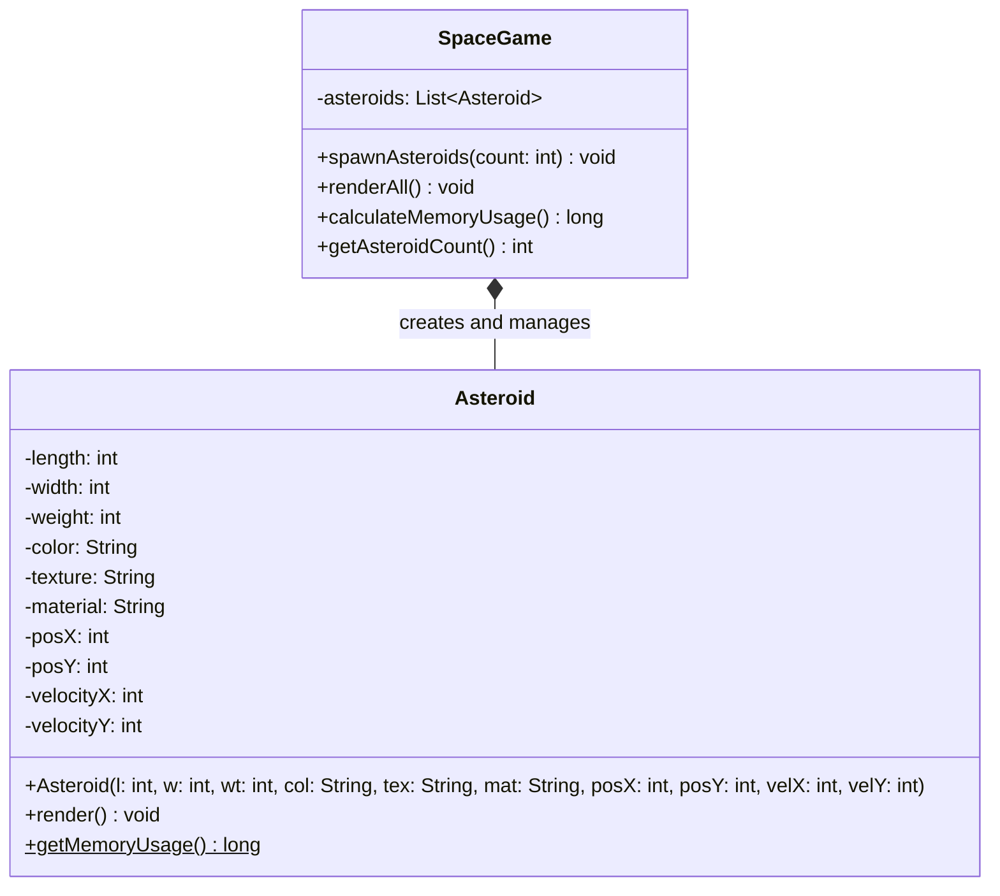
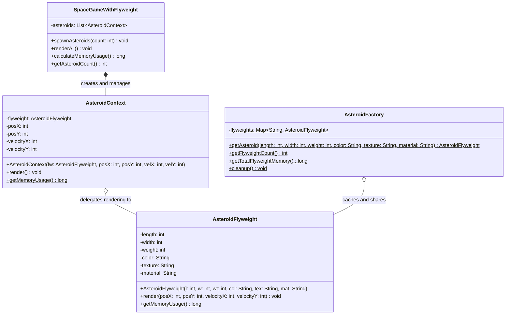

# 🔗 Flyweight Design Pattern:

The Flyweight Design Pattern is a structural software design pattern that enables programs to support vast quantities of objects by keeping their memory consumption low. It achieves this by sharing parts of the object state between multiple objects, rather than keeping all the data in each individual object.

This repository demonstrates the Flyweight pattern using a classic game development scenario: **Rendering 1,000,000 asteroids in a Space Game**. It compares a traditional, memory-heavy approach with a highly optimized Flyweight approach.

---

## 🏗️ Architecture & UML Diagrams

The core concept of the Flyweight pattern is dividing an object's state into two distinct parts:

* **Intrinsic State**: The data that is constant and shared across many objects (e.g., color, texture, material, size).
* **Extrinsic State**: The data that is unique to a specific instance and changes over time (e.g., coordinates, velocity).

Below are the separate UML diagrams demonstrating the architectures of both approaches.

### 1. Without Flyweight (The Unoptimized Approach)

In this standard approach, every single asteroid instance holds all its data, resulting in massive data duplication.

### 2. With Flyweight (The Optimized Approach)

In the optimized approach, the heavy intrinsic state is extracted into a shared `AsteroidFlyweight` object, which is cached by a factory. The unique extrinsic state is kept in lightweight `AsteroidContext` objects.

---

## 🧩 The Core Mechanics: How It Works

### The Unoptimized "Without Flyweight" Mechanics

* **The Object:** The `Asteroid` class holds both shared traits (length, width, weight, color, texture, material) and unique positional traits (posX, posY, velocityX, velocityY).

* **The Execution:** When `SpaceGame` spawns 1,000,000 asteroids, it creates 1,000,000 full `Asteroid` instances.

* **The Problem:** Because the string data (like "Rocky", "Iron", "Red") and base dimensions are duplicated 1,000,000 times in memory, the application consumes an enormous amount of RAM. The approximate memory calculation assumes 7 integers and 3 strings per object.

### The Optimized "With Flyweight" Mechanics

* **The Flyweight (`AsteroidFlyweight`):** This class stores only the intrinsic state (length, width, weight, color, texture, material). Its `render()` method is modified to accept the unique positional data (`posX`, `posY`, `velocityX`, `velocityY`) as parameters instead of storing them.

* **The Factory (`AsteroidFactory`):** This static factory manages a `HashMap` cache of `AsteroidFlyweight` objects. When a request comes in to create an asteroid, the factory generates a unique string key based on the intrinsic properties. If a flyweight with that key exists, it returns the cached instance; otherwise, it creates a new one, caches it, and returns it.

* **The Context (`AsteroidContext`):** This class replaces the heavy Asteroid object. It stores only the extrinsic state (`posX`, `posY`, `velocityX`, `velocityY`) and holds a reference pointer to its corresponding shared `AsteroidFlyweight`.

* **The Execution:** When `SpaceGameWithFlyweight` spawns 1,000,000 asteroids, it creates 1,000,000 lightweight `AsteroidContext` objects. Because there are only a few combinations of colors, textures, and materials, the factory only creates and caches a handful of `AsteroidFlyweight` instances, which are shared across all 1,000,000 contexts.

---

## 🛡️ SOLID Principles Analysis

By refactoring the code to use the Flyweight pattern, the system better adheres to core design principles:

### 1. Single Responsibility Principle (SRP) ✅

* Responsibilities are now strictly separated in the optimized version.

* `AsteroidFlyweight` is solely responsible for maintaining shared physical characteristics.

* `AsteroidContext` is solely responsible for maintaining positional data in the game world.

* `AsteroidFactory` is solely responsible for caching and instantiation logic.

### 2. Open/Closed Principle (OCP) ✅

* The architecture allows for easy extension.

* You can introduce new types of shared states (e.g., `PlanetFlyweight` or `ShipFlyweight`) or new Contexts without altering the underlying caching logic found in the factory.