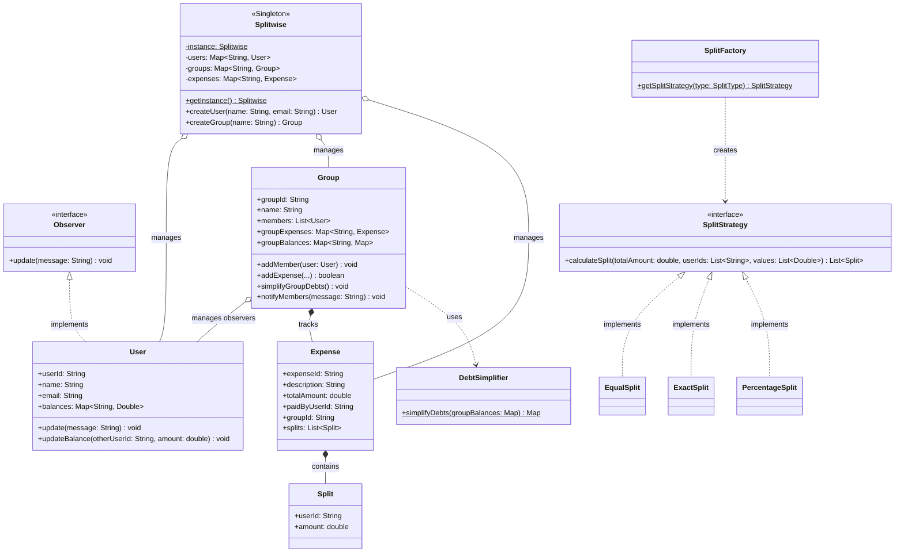

# 💸 Expense Sharing & Debt Simplification System

## 1. System Overview

The **Expense Sharing & Debt Simplification System** (Splitwise clone) is an object-oriented Java application designed to manage shared expenses among friends and groups. It handles user creation, group management, dynamic expense splitting, and notifications.

A core feature of the architecture is its debt simplification algorithm, which uses a greedy approach to consolidate and minimize the total number of transactions required to settle debts within a group. The application relies on several design patterns to decouple the split calculations, event notifications, and object instantiations.

---

## 2. Architecture UML Diagram

Below is the visual UML class diagram illustrating the class relationships, design pattern integrations, and object flow across the system based on the provided Java implementation:

---

## 3. Design Patterns Implemented

The codebase strategically incorporates several software design patterns to ensure clean separation of calculation logic, state management, and user notifications.

### **A. Strategy Pattern (Behavioral)**

* **Where it is used:** The `SplitStrategy` interface and its concrete implementations (`EqualSplit`, `ExactSplit`, `PercentageSplit`).

* **How it works:** It encapsulates the specific algorithms for dividing an expense amount among multiple users.

* **Why it was used:** It allows the system to change how an expense is divided at runtime without modifying the core `Expense` or `Group` classes.

### **B. Observer Pattern (Behavioral)**

* **Where it is used:** The `Observer` interface, implemented by the `User` class.

* **How it works:** The `Group` class acts as the observable subject (or publisher), maintaining a list of `User` members (observers). It calls the `update()` method on all members via `notifyMembers()` whenever a new expense is added or a settlement occurs.

* **Why it was used:** It creates a decoupled notification system where the group does not need to know the internal implementation details of how a user processes notifications.

### **C. Factory Pattern (Creational)**

* **Where it is used:** The `SplitFactory` class.

* **How it works:** It exposes a static `getSplitStrategy()` method that takes a `SplitType` enum value and returns the corresponding `SplitStrategy` object.

* **Why it was used:** It centralizes the instantiation of strategy objects, keeping the `Group` and `Splitwise` classes clean of conditional creation logic.

### **D. Singleton & Facade Patterns (Creational & Structural)**

* **Where it is used:** The main `Splitwise` manager class.

* **How it works:** It uses a private constructor and a static `getInstance()` method to ensure only one instance exists. It also exposes simplified methods (like `addUserToGroup` or `addExpenseToGroup`) that delegate work to the underlying `User` and `Group` objects.

* **Why it was used:** It provides a single, global registry to track all active users, groups, and individual expenses, while offering a clean, simplified interface for the client application to interact with.

---

## 4. SOLID Principles Analysis

### **1. Single Responsibility Principle (SRP) ✅**

* Responsibilities are strictly separated across the system.

* The `DebtSimplifier` is solely responsible for executing the mathematical greedy algorithm to consolidate balances.

* The `SplitFactory` is solely responsible for strategy instantiation.

### **2. Open/Closed Principle (OCP) ✅**

* The system is highly extensible regarding splitting logic.

* Adding a new split method (e.g., `SharesSplit`) simply requires implementing the `SplitStrategy` interface and adding it to the `SplitFactory` switch statement, without altering any existing financial calculation logic.

### **3. Dependency Inversion Principle (DIP) ✅**

* The high-level expense creation logic depends on abstractions.

* When calculating shares, the system relies entirely on the `SplitStrategy` interface rather than depending tightly on the concrete `EqualSplit` or `ExactSplit` classes.

---

## 5. Architectural Vulnerabilities & Future Improvements

Based on the provided implementation, here are potential vulnerabilities and areas for system enhancement:

* **Floating-Point Inaccuracies:** The system relies on primitive `double` data types for critical financial variables like `amount` and `totalAmount`. This can lead to rounding errors in complex fractional calculations.

* **Fix:** Migrate to `java.math.BigDecimal` to guarantee precision for all monetary transactions.

* **Thread Safety in Singleton Instantiation:** The `getInstance()` method in the `Splitwise` class checks if the instance is null and instantiates it without thread-locking mechanisms.

* **Fix:** Introduce a `synchronized` block or utilize double-checked locking inside the method to prevent race conditions in concurrent environments.

* **Missing Validation Logic:** The `ExactSplit` and `PercentageSplit` classes currently contain placeholder comments (`//validations`) but lack actual logic to verify if the provided values sum up correctly to the total amount or to 100%.

* **Fix:** Implement strict exception-throwing validation checks inside these strategies before calculating splits.